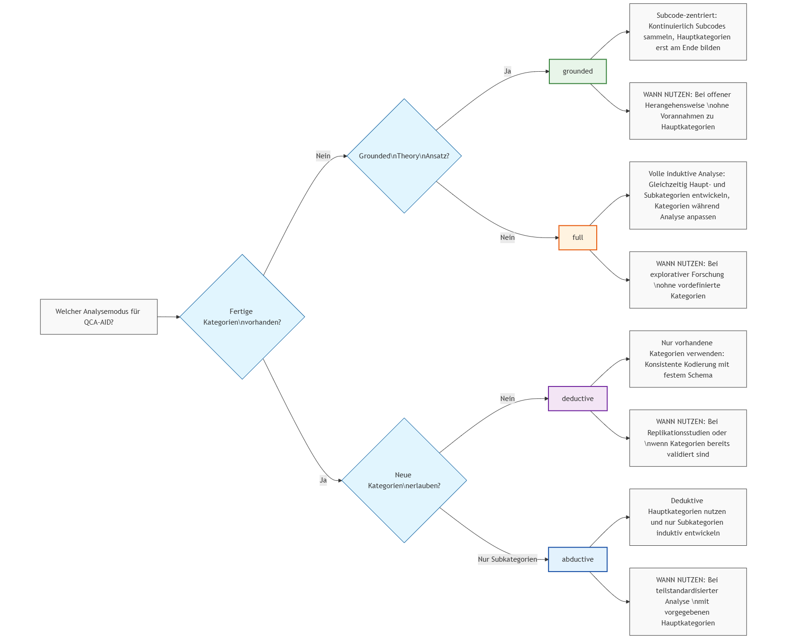

# QCA-AID: Qualitative Content Analysis - with AI-supported Discovery

Dieses Python-Skript implementiert Mayrings Methode der deduktiven Qualitativen Inhaltsanalyse mit induktiver Erweiterung mit KI-Unterstützung. Es kombiniert traditionelle qualitative Forschungsmethoden mit modernen KI-Fähigkeiten, um Forschende bei der Analyse von Dokumenten- und Interviewdaten zu unterstützen. Das Ziel dieses Tools ist nicht, die menschliche Arbeit der Inhaltsanalyse zu ersetzen, sondern neue Möglichkeiten zu eröffnen, mehr Zeit für die Analyse und Reflexion bereits vorstrukturierter Textdaten zu gewinnen.

**🔒 Datenschutz-Hinweis:** QCA-AID unterstützt **lokale LLM-Modelle** (LM Studio, Ollama) für maximalen Datenschutz. Ihre Daten bleiben zu 100% auf Ihrem Computer - ideal für sensible Forschungsdaten und DSGVO-konforme Analysen. Siehe [Lokale Modelle](#lokale-modelle-lm-studio--ollama--empfohlen-für-datenschutz) für Details. 

## Anwendungsmöglichkeiten von QCA-AID

- Es ermöglicht mehr Dokumente in einer Untersuchung zu berücksichtigen als in herkömmlichen Verfahren, bei denen Personalkapazitäten stark begrenzt sind.    
- Es ermöglicht die Umsetzung von Intercoder-Vergleichen mittels zugeschalteten KI-Coder, wo sonst nur ein menschlicher Coder pro Dokument arbeiten würde, und kann damit zur Qualitätsverbesserung beitragen
- QCA-AID kann auch ganz ohne KI-Coder genutzt werden, als Alternative zu kostenpflichtigen Programmen.
- Es ermöglicht zusätzliche explorative Dokumentenanalysen, die sonst aus pragmatischen Gründen mit einfacheren Verfahren umgesetzt würden

**Zu beachten**

- Gefahr der Überkonfidenz in eine automatisiert ermittelte Struktur der Daten 
- Bei geringer Anzahl von Dokumenten überwiegen weiterhin die Vorteile menschlicher Kodierung (Close-reading, Kontextverständnis, Erfahrung)

__ACHTUNG!__
Bitte beachten Sie, dass sich dieses Skript noch in der Entwicklung befindet und möglicherweise noch nicht alle Funktionen optimal arbeiten. Es wird aktuell eine Nutzung zu Testzwecken empfohlen, wenn die Ergebnisse einer manuellen Prüfung des Outputs reliabel und valide sind, kann eine weiterführende Nutzung in Betracht gezogen werden. Am besten kodieren Sie dafür einen Teil der Dokumente (z.B. 10%) manuell und nutzen sie die integrierte Intercoderanalyse.

Prüfen Sie regelmäßig, ob eine neue Version hier bereitgestellt ist und verfolgen sie die Änderungen.
Beachten Sie auch, dass KI-Ergebnisse nicht perfekt sind und die Ergebnisse von der Qualität der Eingabedaten (Forschungsfrage, Codesystem, Text-Material) abhängen.
Sie verwenden das Skript auf eigene Verantwortung, ohne jegliche Gewährleistung.  

__TIPP: Achten Sie darauf, Ihre Kategorien im Codebook sehr präzise zu formulieren, da die Kodierung sehr sensibel darauf reagiert. Unscharfe Definitionen und Kriterien führen mitunter zu übermäßig freizügiger Kodierung. Textnahe Codes sind meist besser als welche mit hohem Abstraktionsgrad (die benötigen mehr definitorische Erläuterung).__

--> Feedback ist willkommen! <--
Kontakt: justus.henke@hof.uni-halle.de

__Hinweis zum Datenschutz__

Die KI-gestützte Datenverarbeitung kann auf zwei Arten erfolgen:

### Option 1: Cloud-basierte Modelle (OpenAI, Anthropic, Mistral)
- **Vorteile:** Höchste Qualität, schnelle Verarbeitung, einfache Einrichtung
- **Datenschutz:** Daten werden an externe Anbieter übermittelt
- **Empfehlung:** Prüfen Sie, ob Ihre Dokumente dafür freigegeben sind und entfernen Sie ggf. sensible Informationen
- **Hinweis:** Auch wenn diese Anfragen offiziell nicht für das Training von Modellen genutzt werden, stellt dies eine Verarbeitung durch Dritte dar

### Option 2: Lokale Modelle (LM Studio, Ollama) ⭐ **Empfohlen für sensible Daten**
- **Vorteile:** 
  - ✅ **100% Datenschutz** - Alle Daten bleiben auf Ihrem Computer
  - ✅ **Kostenlos** - Keine API-Gebühren
  - ✅ **Offline-fähig** - Keine Internetverbindung erforderlich
  - ✅ **DSGVO-konform** - Keine Datenübermittlung an Dritte
- **Einrichtung:** 
  - LM Studio: [https://lmstudio.ai/](https://lmstudio.ai/)
  - Ollama: [https://ollama.ai/](https://ollama.ai/)
  - Siehe [LOCAL_MODELS_GUIDE.md](LOCAL_MODELS_GUIDE.md) für detaillierte Anleitung
- **Webapp-Integration:** Wählen Sie "Local (LM Studio/Ollama)" als Modell-Anbieter

**Für hochsensible Daten wird die Nutzung lokaler Modelle ausdrücklich empfohlen!**


## Inhaltsverzeichnis

### Grundlagen
- [Anwendungsmöglichkeiten](#anwendungsmöglichkeiten)
- [Merkmale von QCA-AID](#merkmale-von-qca-aid)
  - [Textverarbeitung und Vorbereitung](#textverarbeitung-und-vorbereitung)
  - [Kodierungsfunktionen](#kodierungsfunktionen)
  - [Qualitätssicherung](#qualitätssicherung)
  - [Export und Dokumentation](#export-und-dokumentation)
  - [Konfiguration und Anpassbarkeit](#konfiguration-und-anpassbarkeit)

📄 [Zur vollständigen Release-Historie](CHANGELOG.md)


### Installation und Einrichtung
- [Empfehlungen für die Installation](#empfehlungen-für-die-installation)
- [Installation](#installation)
- [Speichern des API-Schlüssels](#speichern-des-api-schlüssels)

### QCA-AID Webapp (NEU!)
- [Webapp-Übersicht](#qca-aid-webapp)
- [Webapp-Schnellstart](WEBAPP_QUICKSTART.md)
- [Webapp-Benutzerhandbuch](WEBAPP_README.md)
- [Webapp-Fehlerbehebung](WEBAPP_TROUBLESHOOTING.md)
- [Webapp-API-Dokumentation](WEBAPP_API.md)


### Systemarchitektur
|- [Architekturübersicht](#architekturübersicht)
### Konfiguration und Nutzung
- [Unterstützte Eingabedateien](#unterstützte-eingabedateien)
- [QCA-AID: Konfiguration und Nutzung](#qca-aid-konfiguration-und-nutzung)
  - [Konfigurationsformate: Excel vs. JSON](#konfigurationsformate-excel-vs-json)
  - [Codebook.xlsx](#codebookxlsx)
  - [Codebook.json](#codebookjson)
  - [Automatische Synchronisation](#automatische-synchronisation)
  - [Verzeichnisstruktur](#verzeichnisstruktur)
  - [Starten der Analyse](#starten-der-analyse)

### Praktische Anwendung
- [Batch-Größe und Performance-Optimierung](#batch-größe-und-performance-optimierung)
- [Empfohlene Workflows](#empfohlene-workflows)
  - [Erste Schritte mit QCA-AID](#1-erste-schritte-mit-qca-aid)
  - [Fortgeschrittene Analysestrategien](#2-fortgeschrittene-analysestrategien)
- [Best Practices](#best-practices)
- [Konfigurationsempfehlungen](#konfigurationsempfehlungen)
- [Tipps für die effiziente Nutzung](#tipps-für-die-effiziente-nutzung)
- [Beispiel für eine typische Analyse](#beispiel-für-eine-typische-analyse)

### Fehlerbehebung
- [Häufige Probleme und Lösungen](#häufige-probleme-und-lösungen)

### Referenzen
- [Zitiervorschlag](#zitiervorschlag)


### Transformation von monolithisch zu modular

**Vorher (< 0.10.0):**
- QCA_Utils.py: 3954 Zeilen Monolith mit 15+ Klassen
- Code in main.py und QCA_Utils.py stark verflochten
- Schwierig zu testen (zirkuläre Dependencies)
- Schwierig zu erweitern (neuer Provider/Export-Format = Monolith-Änderung)

**Nachher (0.10.0+):**
- 8 spezialisierte Fachmodule in `utils/`
- Klare Modul-Grenzen und Abhängigkeiten
- Isoliert testbar (Unit Tests ohne API-Calls)
- Einfach erweiterbar (Neuer LLM-Provider = neue Datei in `utils/llm/`)

### Vorteile der neuen Modulararchitektur

| Aspekt | Vorteil |
|--------|--------|
| **Wartbarkeit** | Spezialisierte Module mit klaren Verantwortlichkeiten, reduzierte Komplexität pro Datei |
| **Testbarkeit** | Isolierte Module ermöglichen Unit-Testing ohne API-Dependencies, bessere Mock-Möglichkeiten |
| **Skalierbarkeit** | Neuer LLM-Provider, Export-Format oder Analysetyp = neue Datei, keine Monolith-Änderung |
| **Wartung** | Weniger zirkuläre Abhängigkeiten, lineare Abhängigkeitsgraphen |
| **Onboarding** | Neue Entwickler verstehen Module schneller durch fokussierte Verantwortung |
| **Robustheit** | Windows Unicode-Kodierungsfixes, bessere Fehlerbehandlung pro Modul |

### Modul-Verantwortlichkeiten

| Modul | Verantwortlichkeit | Dependencies |
|-------|-------------------| ------------|
| `llm/` | LLM-API-Integration, Provider-Abstraktion (OpenAI, Mistral) | openai, mistralai, requests |
| `config/` | Excel-Konfiguration laden und validieren | openpyxl, pandas |
| `tracking/` | Token-Zählung, Kostenberechnung | tiktoken |
| `dialog/` | Tkinter GUI für manuelle Kodierung | tkinter (stdlib) |
| `export/` | Excel/PDF-Export, Format-Konvertierung | openpyxl, pandas, PyPDF2 |
| `io/` | Dokumentenladung (.pdf/.docx/.txt) | PyPDF2, python-docx, spacy |
| `analysis/` | Hilfsreiches für Kodierungslogik | (keine externen Dependencies) |

## QCA-AID Webapp

**NEU in Version 0.11.0**: QCA-AID bietet jetzt eine vollständige webbasierte Benutzeroberfläche!

Die QCA-AID Webapp ist eine lokale, webbasierte Anwendung, die eine intuitive Alternative zur Kommandozeile und direkten Bearbeitung von Konfigurationsdateien bietet.

### Hauptfunktionen

- **Grafische Konfigurationsverwaltung**: Alle Einstellungen über eine intuitive Oberfläche
- **Visueller Codebook-Editor**: Kategorien, Definitionen und Regeln strukturiert bearbeiten
- **Integrierte Analyse-Steuerung**: Analysen direkt aus der Webapp starten und überwachen
- **Echtzeit-Fortschrittsanzeige**: Live-Updates während der Analyse
- **Explorer-Integration**: Ergebnisse direkt in der Webapp verwalten
- **Localhost-Only**: Alle Daten bleiben sicher auf Ihrem Computer

### Schnellstart


```bash
# Webapp starten
python start_webapp.py

# Öffnet automatisch im Browser: http://127.0.0.1:8501
```

### Dokumentation

- **[Schnellstart-Anleitung](WEBAPP_QUICKSTART.md)**: In 5 Minuten loslegen
- **[Vollständiges Benutzerhandbuch](WEBAPP_README.md)**: Detaillierte Anleitung
- **[Fehlerbehebung](WEBAPP_TROUBLESHOOTING.md)**: Lösungen für häufige Probleme
- **[API-Dokumentation](WEBAPP_API.md)**: Für Entwickler und Erweiterungen
- **[Beispielkonfigurationen](examples/)**: Vorkonfigurierte Templates

### Vorteile der Webapp

| Aspekt | Kommandozeile | Webapp |
|--------|---------------|--------|
| **Einstieg** | Technisches Wissen erforderlich | Intuitiv, keine Vorkenntnisse |
| **Konfiguration** | Excel/JSON direkt bearbeiten | Grafische Oberfläche mit Validierung |
| **Fehlerprüfung** | Manuell | Automatische Inline-Validierung |
| **Fortschritt** | Terminal-Ausgabe | Visueller Fortschrittsbalken |
| **Dateiverwaltung** | Dateisystem | Integrierte Dateiübersicht |

### Wann welche Version nutzen?

**Nutzen Sie die Webapp wenn:**
- Sie eine grafische Oberfläche bevorzugen
- Sie häufig Konfigurationen anpassen
- Sie Analysen interaktiv überwachen möchten
- Sie neu bei QCA-AID sind

**Nutzen Sie die Kommandozeile wenn:**
- Sie Batch-Verarbeitung automatisieren möchten
- Sie Skripte für wiederholte Analysen schreiben
- Sie auf einem Server ohne GUI arbeiten
- Sie maximale Performance benötigen


### Merkmale von QCA-AID

#### Textverarbeitung und Vorbereitung
- **Automatisierte Textvorverarbeitung**: Konvertierung verschiedener Dokumentformate (.txt, .pdf, .docx)
- **Intelligentes Chunking**: Aufteilung von Texten in analysierbare Segmente mit konfigurierbarer Überlappung
- **Relevanzprüfung**: Automatische Bewertung der Textsegmente vor der Kodierung mit konfigurierbaren Ausschlusskriterien

#### Kodierungsfunktionen
- **Deduktive Kategorienanwendung**: Systematische Anwendung vordefinierter Kategorien
- **Induktive Kategorienerweiterung**: Erkennung neuer Kategorien und Subkategorien im Material
- **Abduktiver Modus**: Erweiterung nur auf Subkategorien-Ebene ohne neue Hauptkategorien
- **Grounded Theory Modus**: Schrittweise Sammlung von Subcodes mit späterer Hauptkategoriengenerierung
- **Multi-Coder-Unterstützung**: Parallele Kodierung durch mehrere KI- und optionale menschliche Kodierer
- **Kontextuelle Kodierung**: Progressive Dokumentenzusammenfassung für kontextsensitive Analyse
- **Batch-Verarbeitung**: Konfigurierbare Anzahl gleichzeitig zu verarbeitender Textsegmente
- **Manueller Kodierungsmodus**: Intuitive Benutzeroberfläche für menschliche Kodierung mit Fortschrittssicherung

#### Qualitätssicherung
- **Intercoder-Reliabilitätsanalyse**: Automatische Berechnung der Übereinstimmung zwischen Kodierern
- **Konsensbildung**: Mehrstufiger Prozess zur Konsensfindung bei divergierenden Kodierungen
- **Manuelles Code-Review**: Systematische Überprüfung und Korrektur von Kodierungsentscheidungen
- **Kategoriesystem-Validierung**: Überprüfung und Optimierung des Kategoriensystems
- **Sättigungsprüfungen**: Iterative Analyse mit automatischer Erkennung theoretischer Sättigung
- **Fortschrittssicherung**: Automatische Sicherung des Kodierfortschritts für kontinuierliche Arbeit

#### Export und Dokumentation
- **Umfassender Analysebericht**: Excel-Export mit Kodierungen, Häufigkeitsanalysen und Intercoderstatistiken
- **Kategorienentwicklungs-Dokumentation**: Nachvollziehbare Historisierung aller Änderungen am Kategoriensystem
- **Codebook-Export**: Speicherung des erweiterten Kodierungssystems für zukünftige Analysen
- **Attributbasierte Analyse**: Automatische Extraktion von Metadaten aus Dateinamen für vergleichende Auswertungen
- **Token-Tracking**: Schätzung und Dokumentation der verwendeten API-Tokens

#### Konfiguration und Anpassbarkeit
- **Flexible Modellwahl**: Unterstützung verschiedener KI-Anbieter (OpenAI, Anthropic, Mistral, OpenRouter, lokale Modelle)
- **Dynamisches Modell-Management**: Automatisches Laden aktueller Modelle von allen Providern
- **Konfigurierbare Parameter**: Anpassung von Chunk-Größe, Überlappung, Batch-Größe und weiteren Einstellungen
- **Temperaturstufen**: Steuerung der "Kreativität" bei der induktiven Kategorienentwicklung
- **Anpassbarer Analysemodus**: Wahl zwischen vollständiger, abduktiver, deduktiver oder grounded Theory Analyse
- **Excel-basierte Konfiguration**: Einfache Anpassung aller Einstellungen über Excel-Dateien
- **Erweiterte Visualisierungsoptionen**: Konfigurierbare Diagramme und Analysen im QCA-AID-Explorer

## LLM-Provider und API-Keys

### Unterstützte Provider

QCA-AID unterstützt ab Version 0.10.4 mehrere LLM-Provider:

| Provider | Modelle | API-Key Variable | Datenschutz |
|----------|---------|------------------|-------------|
| **OpenAI** | GPT-4o, GPT-4o-mini, GPT-4-turbo, GPT-4, GPT-3.5-turbo | `OPENAI_API_KEY` | ⚠️ Cloud |
| **Anthropic** | Claude Sonnet 4.5, Claude 3.5 Sonnet, Claude 3 Opus | `ANTHROPIC_API_KEY` | ⚠️ Cloud |
| **Mistral** | Mistral Large, Mistral Medium, Mistral Small | `MISTRAL_API_KEY` | ⚠️ Cloud |
| **OpenRouter** | Verschiedene Modelle über eine API | `OPENROUTER_API_KEY` | ⚠️ Cloud |
| **Lokal** ⭐ | LM Studio, Ollama | Kein API-Key erforderlich | ✅ **100% Lokal** |

**Für sensible Daten empfehlen wir lokale Modelle!**

### API-Keys einrichten

#### Empfohlene Methode: .env Datei

1. Erstellen Sie eine Datei namens `.env` im QCA-AID-Projektverzeichnis
2. Fügen Sie Ihre API-Keys hinzu:

```bash
# OpenAI
OPENAI_API_KEY=sk-proj-...

# Anthropic
ANTHROPIC_API_KEY=sk-ant-...

# Mistral
MISTRAL_API_KEY=...

# OpenRouter
OPENROUTER_API_KEY=sk-or-...
```

3. Die `.env` Datei wird automatisch beim Start geladen
4. **Wichtig**: Fügen Sie `.env` zu Ihrer `.gitignore` hinzu, um API-Keys nicht versehentlich zu veröffentlichen

#### Alternative: Systemumgebungsvariablen

**Windows:**
```cmd
setx OPENAI_API_KEY "sk-proj-..."
setx ANTHROPIC_API_KEY "sk-ant-..."
```

**Linux/Mac:**
```bash
export OPENAI_API_KEY="sk-proj-..."
export ANTHROPIC_API_KEY="sk-ant-..."
```

### Modellauswahl in der Webapp

Die Webapp zeigt automatisch alle verfügbaren Modelle für den gewählten Provider an:

1. Öffnen Sie den **Konfiguration**-Tab
2. Wählen Sie unter **Modell-Anbieter** Ihren gewünschten Provider
3. Das **Modell-Name** Dropdown zeigt alle verfügbaren Modelle
4. Die Modelliste wird automatisch aktualisiert (24h Cache)

### Lokale Modelle (LM Studio / Ollama) ⭐ **Empfohlen für Datenschutz**

Für lokale Modelle:

1. **Installation:**
   - LM Studio: [https://lmstudio.ai/](https://lmstudio.ai/) (Empfohlen für Einsteiger)
   - Ollama: [https://ollama.ai/](https://ollama.ai/) (Für fortgeschrittene Nutzer)

2. **Modell laden:**
   - LM Studio: Modell herunterladen und Server starten (Port 1234)
   - Ollama: `ollama pull llama3.1:8b` (Port 11434)

3. **In der Webapp:**
   - Wählen Sie "Local (LM Studio/Ollama)" als Provider
   - Klicken Sie auf "🔄 Erkennen"
   - Wählen Sie ein erkanntes Modell aus

4. **Vorteile:**
   - ✅ **100% Datenschutz** - Keine Datenübermittlung
   - ✅ **Kostenlos** - Keine API-Gebühren
   - ✅ **Offline** - Keine Internetverbindung erforderlich
   - ✅ **DSGVO-konform** - Ideal für sensible Forschungsdaten

**Detaillierte Anleitung:** Siehe [LOCAL_MODELS_GUIDE.md](LOCAL_MODELS_GUIDE.md)

### Kosten und Pricing

- Modellkosten werden automatisch aus den Provider-Metadaten geladen
- Anzeige der Kosten pro 1M Input/Output-Tokens
- Eigene Preise können über `pricing_overrides.json` definiert werden
- Token-Tracking dokumentiert die Nutzung für Kostenschätzung


## Zitiervorschlag

Henke, J. (2025). QCA-AID: Qualitative Content Analysis with AI-supported Discovery (Version 0.11.0) [Software]. 
Institut für Hochschulforschung Halle-Wittenberg. https://github.com/JustusHenke/QCA-AID

```BibTex
@software{Henke_QCA-AID_2025,
  author       = {Henke, Justus},
  title        = {{QCA-AID: Qualitative Content Analysis with AI-supported Discovery}},
  month        = december,
  year         = {2025},
  publisher    = {Institut für Hochschulforschung Halle-Wittenberg},
  version      = {0.11.0},
  url          = {https://github.com/JustusHenke/QCA-AID}
}
```

## Empfehlungen für die Installation

Bevor Sie mit der Installation beginnen, prüfen Sie folgende Voraussetzungen/Empfehlungen:

1. **GitHub-Konto** (optional): Registrieren Sie sich bei [GitHub](https://github.com/), falls noch nicht geschehen. Dies erleichtert das Synchronisieren von Updates. Synchronisation erfolgt dann mit **Git**: Download verschiedener Clients unter: [https://git-scm.com/downloads](https://git-scm.com/downloads)

2. **OpenAI API-Schlüssel** (sofern nicht Mistral genutzt wird): 
   - Erstellen Sie einen Schlüssel unter: [https://platform.openai.com/api-keys](https://platform.openai.com/api-keys)
   - Fügen Sie ein Zahlungsmittel hinzu und laden Sie Ihr Guthaben auf, da die API kostenpflichtig ist.

3. **Python 3.11 oder älter**:
   - **WICHTIG**: Verwenden Sie Python 3.11 oder älter (z.B. 3.10.12), da QCA-AID aktuell nicht mit Python 3.13 kompatibel ist! Dies liegt daran, dass das Modul spaCy derzeit noch nicht mit Python 3.13 kompatibel ist.
   - Download unter: [https://www.python.org/downloads/release/python-3110/](https://www.python.org/downloads/release/python-3110/)

4. **Nur für Windows-Nutzer**: Microsoft Visual C++ Build Tools
   - Download unter: [https://visualstudio.microsoft.com/de/visual-cpp-build-tools/](https://visualstudio.microsoft.com/de/visual-cpp-build-tools/)
   - Wichtig: Aktivieren Sie im Installer das "C++ Build Tools"-Paket inklusive MSVC und Windows SDK.
5. **Alternativen für  Microsoft Visual C++ Build Tools**:
- Wheel-Pakete: Für gängige Plattformen und Python-Versionen bietet spaCy vorkompilierte Binärpakete (Wheels) an. Wenn ein passendes Wheel verfügbar ist, wird dieses automatisch genutzt und die Build Tools werden nicht benötigt.
- conda-Installation: Bei Verwendung von Anaconda/conda kann spaCy über conda-forge installiert werden, was ebenfalls die Notwendigkeit der Build Tools umgeht

## Installation

1. **Repository klonen**:
   ```bash
   git clone https://github.com/JustusHenke/QCA-AID.git
   cd QCA-AID
   ```

2. **Abhängigkeiten installieren**:
   ```bash
   pip install -r requirements.txt
   ```

3. **Sprachmodell für spaCy installieren**:
   ```bash
   python -m spacy download de_core_news_sm
   ```

4. **Bei Nutzung der Mistral API (optional)**:
   ```bash
   pip install mistralai
   ```

## Speichern des API-Schlüssels

Um den API-Schlüssel sicher zu speichern und zu verwenden, folgen Sie diesen Schritten:

1. **Erstellen Sie eine .environ.env Datei**:
   - Die Datei sollte `.environ.env` im Home-Verzeichnis Ihres Benutzers erstellt werden.
   - Unter Windows ist dies typischerweise: `C:\Users\IhrBenutzername\`
   - Unter macOS und Linux: `/home/IhrBenutzername/`

2. **Dateiinhalt**:
   - Öffnen Sie die .environ.env Datei mit einem Texteditor.
   - Fügen Sie folgende Zeilen hinzu, ersetzen Sie dabei `IhrAPISchlüssel` mit Ihren tatsächlichen API-Schlüsseln:
     ```
     OPENAI_API_KEY=IhrAPISchlüssel
     MISTRAL_API_KEY=IhrAPISchlüssel
     ```

3. **Sicherheitshinweis**:
   - Stellen Sie sicher, dass die .environ.env Datei nicht in öffentliche Repositories hochgeladen wird.
   - Fügen Sie `.environ.env` zu Ihrer .gitignore Datei hinzu, wenn Sie Git verwenden.

## Unterstützte Eingabedateien

Das Programm kann bestimmte Dateitypen im Eingabeverzeichnis (DATA_DIR) verarbeiten. Folgende Dateiformate werden derzeit unterstützt:

1. **Textdateien**:
   - .txt (Plain Text)

2. **Dokumentformate**:
   - .pdf (Portable Document Format)
   - .docx (Microsoft Word)

Hinweise zur Verwendung:
- Stellen Sie sicher, dass Ihre Eingabedateien in einem der oben genannten Formate vorliegen.
- Das Programm liest alle unterstützten Dateien im Eingabeverzeichnis automatisch ein.
- Bei der Verwendung von PDF-Dateien wird der Text extrahiert; komplexe Formatierungen oder eingebettete Bilder werden dabei nicht berücksichtigt.

Für optimale Ergebnisse wird die Verwendung von einfachen Textformaten (.txt) empfohlen, insbesondere für längere Textpassagen oder Transkripte. Entfernen Sie Literaturverzeichnisse und andere Textteile, die nicht kodiert werden sollen.

**Wichtig**: 
- Stellen Sie sicher, dass alle Dateien im Eingabeverzeichnis für die Analyse relevant sind, da das Programm versuchen wird, jede unterstützte Datei zu verarbeiten.
- Andere Dateiformate wie .csv, .md, .srt oder .vtt werden derzeit nicht unterstützt. Konvertieren Sie diese gegebenenfalls in eines der unterstützten Formate.

## QCA-AID: Konfiguration und Nutzung



### Konfigurationsformate: Excel vs. JSON

QCA-AID unterstützt zwei Formate für die Konfiguration:

#### Excel-Format (QCA-AID-Codebook.xlsx)
- **Vorteile**: Vertraute Oberfläche, einfache Bearbeitung, keine technischen Kenntnisse erforderlich
- **Nachteile**: Langsamer beim Laden, schwieriger für Versionskontrolle

#### JSON-Format (QCA-AID-Codebook.json)
- **Vorteile**: 
  - **10x schneller** beim Laden
  - Ideal für Versionskontrolle mit Git
  - Bessere Lesbarkeit für technisch versierte Nutzer
  - Einfachere Automatisierung und Skripterstellung
- **Nachteile**: Erfordert Grundkenntnisse in JSON-Syntax

#### Welches Format sollten Sie verwenden?

- **Einsteiger**: Nutzen Sie Excel - es ist intuitiver und einfacher zu bearbeiten
- **Fortgeschrittene**: JSON bietet mehr Flexibilität und Performance
- **Teams**: Beide Formate können parallel genutzt werden - sie synchronisieren sich automatisch

**Wichtig**: Sie müssen sich nicht entscheiden! QCA-AID synchronisiert beide Formate automatisch. Änderungen in einer Datei werden automatisch in die andere übertragen.

### Codebook.xlsx

Die Excel-Datei `QCA-AID-Codebook.xlsx` ist zentral für die Konfiguration der Analyse und enthält:

#### Tabellenblätter
- **FORSCHUNGSFRAGE**: Tragen Sie Ihre Forschungsfrage in Zelle B1 ein
- **KODIERREGELN**: Allgemeine Kodierregeln (Spalte A), Formatregeln (Spalte B), Ausschlusskriterien für die Relevanzprüfung (Spalte C)
- **DEDUKTIVE_KATEGORIEN**: Hauptkategorien mit Definition, Regeln, Beispielen und Subkategorien
- **CONFIG**: Technische Einstellungen wie Modell, Verzeichnisse und Chunk-Größen

#### Struktur der DEDUKTIVE_KATEGORIEN

     | Key       | Sub-Key     | Sub-Sub-Key | Value                        |
     |-----------|-------------|-------------|------------------------------|
     | Akteure   | definition  |             | Erfasst alle handelnden...   |
     | Akteure   | rules       |             | Codiere Aussagen zu: Indi... |
     | Akteure   | examples    | [0]         | Die Arbeitsgruppe trifft...  |
     | Akteure   | subcategories | Individuelle_Akteure | Einzelpersonen und deren... |

#### Struktur der CONFIG
Hier können Sie verschiedene Konfigurationsparameter einstellen:
- **MODEL_PROVIDER**: Name des LLM-Anbieters ('OpenAI' oder 'Mistral')
- **MODEL_NAME**: Name des zu verwendenden Sprachmodells
- **DATA_DIR**: Verzeichnis für Eingabedaten
- **OUTPUT_DIR**: Verzeichnis für Ausgabedaten
- **CHUNK_SIZE**: Größe der Textabschnitte für die Analyse
- **CHUNK_OVERLAP**: Überlappung zwischen Textabschnitten
- **BATCH_SIZE**: Anzahl der parallel zu verarbeitenden Textabschnitte (Standard: 5)
- **ATTRIBUTE_LABELS**: Bezeichnungen für Attribute, die aus dem Dateinamen extrahiert werden (z.B. "Part1_Part2_Restname.txt")
- **CODER_SETTINGS**: Einstellungen für automatische Kodierer
- **ANALYSIS_MODE**: Analysemodus ('full', 'abductive', 'deductive', 'grounded')
- **CODE_WITH_CONTEXT**: Aktiviert kontextuelle Kodierung (true/false)
- **AUTO_SAVE_INTERVAL**: Intervall für automatische Sicherung des Kodierfortschritts (in Minuten)
- **MANUAL_CODING_ENABLED**: Aktiviert den manuellen Kodierungsmodus (true/false)
- **REVIEW_MODE**: Modus für die Überprüfung von Kodierungen ('consensus', 'majority', 'manual_priority')

### Codebook.json

Die JSON-Datei `QCA-AID-Codebook.json` ist eine Alternative zum Excel-Format und bietet die gleiche Funktionalität.

#### Vorteile der JSON-Konfiguration

- **Performance**: Bis zu 10x schnelleres Laden als Excel
- **Versionskontrolle**: Ideal für Git - Änderungen sind nachvollziehbar
- **Automatisierung**: Einfacher für Skripte und Batch-Verarbeitung
- **Portabilität**: Plattformunabhängig und zukunftssicher

#### Struktur der JSON-Datei

```json
{
  "forschungsfrage": "Ihre Forschungsfrage...",
  "kodierregeln": {
    "general": ["Regel 1", "Regel 2"],
    "format": ["Format 1"],
    "exclusion": ["Ausschluss 1"]
  },
  "deduktive_kategorien": {
    "Kategorie_1": {
      "definition": "Definition...",
      "rules": ["Regel 1"],
      "examples": ["Beispiel 1", "Beispiel 2"],
      "subcategories": {
        "Subkategorie_1": "Beschreibung"
      }
    }
  },
  "config": {
    "MODEL_PROVIDER": "OpenAI",
    "MODEL_NAME": "gpt-4o-mini",
    "CHUNK_SIZE": 1000,
    "ANALYSIS_MODE": "deductive"
  }
}
```

#### Wichtige Hinweise zur JSON-Syntax

- **Boolean-Werte**: Verwenden Sie `true` oder `false` (ohne Anführungszeichen)
- **Zahlen**: Schreiben Sie Zahlen ohne Anführungszeichen: `"CHUNK_SIZE": 1000`
- **Strings**: Verwenden Sie doppelte Anführungszeichen: `"MODEL_PROVIDER": "OpenAI"`
- **Null-Werte**: Verwenden Sie `null` für nicht gesetzte Werte
- **Keine Kommentare**: JSON unterstützt keine Kommentare - nutzen Sie die Dokumentation

#### Beispieldatei

Eine vollständige Beispiel-JSON-Datei finden Sie in `QCA-AID-Codebook-Example.json`. Die zugehörige Dokumentation mit detaillierten Erklärungen finden Sie in `QCA-AID-Codebook-Example-Documentation.md`.

### Automatische Synchronisation

QCA-AID synchronisiert Excel- und JSON-Dateien automatisch:

#### Wie funktioniert die Synchronisation?

1. **Beim Start**: QCA-AID prüft, ob beide Dateien existieren
2. **Zeitstempel-Vergleich**: Die neuere Datei wird als Quelle verwendet
3. **Automatische Aktualisierung**: Die ältere Datei wird automatisch aktualisiert
4. **Fehlende Datei**: Wenn nur eine Datei existiert, wird die andere automatisch erstellt

#### Szenarien

**Szenario 1: Nur Excel vorhanden**
```
QCA-AID-Codebook.xlsx ✓
QCA-AID-Codebook.json ✗
→ JSON wird automatisch erstellt
```

**Szenario 2: Nur JSON vorhanden**
```
QCA-AID-Codebook.xlsx ✗
QCA-AID-Codebook.json ✓
→ Excel wird automatisch erstellt
```

**Szenario 3: Beide vorhanden, Excel neuer**
```
QCA-AID-Codebook.xlsx (2024-01-15 14:30) ✓
QCA-AID-Codebook.json (2024-01-15 10:00) ✓
→ JSON wird aus Excel aktualisiert
```

**Szenario 4: Beide vorhanden, JSON neuer**
```
QCA-AID-Codebook.xlsx (2024-01-15 10:00) ✓
QCA-AID-Codebook.json (2024-01-15 14:30) ✓
→ Excel wird aus JSON aktualisiert
```

#### Migration von Excel zu JSON

Wenn Sie von Excel zu JSON wechseln möchten:

1. **Automatische Migration**: Starten Sie QCA-AID einfach mit Ihrer Excel-Datei
2. **JSON wird erstellt**: Die JSON-Datei wird automatisch generiert
3. **Beide Formate nutzen**: Sie können weiterhin beide Formate parallel verwenden
4. **Nur JSON nutzen**: Löschen Sie die Excel-Datei, wenn Sie nur noch JSON verwenden möchten

**Tipp**: Für detaillierte Informationen zur Migration siehe `MIGRATION_GUIDE.md`

#### Konfliktauflösung

Bei Synchronisationsproblemen:
- QCA-AID gibt eine Warnung aus
- Die Quelldatei wird weiterhin verwendet
- Prüfen Sie die Fehlermeldung und korrigieren Sie die Datei
- Starten Sie QCA-AID erneut


#### CODE_WITH_CONTEXT

Wenn CONFIG-Parameter `CODE_WITH_CONTEXT` aktiviert ist (True), nutzt QCA-AID einen progressiven Dokumentkontext für die Kodierung.
Dabei wird für jedes Dokument ein fortlaufend aktualisiertes Summary erstellt, das bei
der Kodierung der nachfolgenden Chunks als Kontext verwendet wird.

Vorteile:
- Bessere Kontextsicherheit durch Berücksichtigung vorheriger Dokumentinhalte
- Verbesserte Kodierqualität bei kontextabhängigen Kategorien (z.B. "dominante Akteure")
- Mehr Konsistenz in der Kodierung eines Dokuments

Nachteile:
- Dokumente müssen sequentiell verarbeitet werden
- Geringer erhöhter Tokenverbrauch
- Mögliche Fehlerfortpflanzung bei falsch interpretierten frühen Abschnitten

Empfehlung:
- Für Analysen mit hierarchischen oder relationalen Kategorien aktivieren
- Für einfache thematische Kategorisierungen kann ohne Kontext gearbeitet werden


### Verzeichnisstruktur

#### Eingabeverzeichnis (input)
- Standardpfad: `input/` im Skriptverzeichnis
- Unterstützte Formate:
  - .txt (Textdateien)
  - .pdf (PDF-Dokumente)
  - .docx (Word-Dokumente)
- Namenskonvention: `attribut1_attribut2_weiteres.extension`
  - Beispiel: `university-type_position_2024-01-01.txt`
  - Die Attribute werden für spätere Analysen genutzt

#### Ausgabeverzeichnis (output)
- Standardpfad: `output/` im Skriptverzeichnis
- Erzeugte Dateien:
  - `QCA-AID_Analysis_[DATUM].xlsx`: Hauptergebnisdatei mit Kodierungen und Analysen
  - `category_revisions.json`: Protokoll der Kategorienentwicklung
  - `codebook_inductive.json`: Erweitertes Kategoriensystem nach induktiver Phase

### Starten der Analyse

1. Stellen Sie sicher, dass Ihre Eingabedokumente im `input/`-Verzeichnis liegen
2. Führen Sie das Skript aus:
   ```bash
   python QCA-AID.py
   ```
3. Folgen Sie den Anweisungen auf dem Bildschirm
4. Die Ergebnisse werden im `output/`-Verzeichnis gespeichert

### Wichtige Hinweise
- Entfernen Sie am besten Literaturverzeichnisse und nicht zu kodierende Textteile aus den Eingabedokumenten
- Prüfen Sie bei PDF-Dokumenten die korrekte Textextraktion
- Sichern Sie regelmäßig die QCA-AID-Codebook.xlsx
- Die Verzeichnispfade können in der CONFIG angepasst werden

## Praktische Anwendungshinweise

### Batch-Größe und Performance-Optimierung

#### Was ist die Batch-Größe?

Die **Batch-Größe** bestimmt, wie viele Textsegmente gleichzeitig in einem API-Call verarbeitet werden. Bei einer `BATCH_SIZE` von 6 werden 6 Textsegmente in einem einzigen Prompt zusammengefasst und gemeinsam analysiert.

#### Funktionsweise

```python
# Konfiguration in der config.json
{
  "BATCH_SIZE": 8,  // 8 Segmente pro API-Call
  "CHUNK_SIZE": 1200
}
```

**Beispiel-Prompt bei BATCH_SIZE = 3:**
```
SEGMENT 1:
[Ihr erster Textabschnitt...]

=== SEGMENT BREAK ===

SEGMENT 2: 
[Ihr zweiter Textabschnitt...]

=== SEGMENT BREAK ===

SEGMENT 3:
[Ihr dritter Textabschnitt...]

Analysiere alle 3 Segmente und kodiere sie entsprechend.
```

#### Auswirkungen verschiedener Batch-Größen

| Batch-Größe | Geschwindigkeit | Kosten | Qualität | Empfohlen für |
|-------------|----------------|--------|----------|---------------|
| **1-3** | 🐌 Langsam | 💰💰💰 Hoch | ⭐⭐⭐ Sehr gut | Präzise Analysen, komplexe Texte |
| **4-8** | 🚀 Mittel | 💰💰 Moderat | ⭐⭐ Gut | **Standard-Empfehlung** |
| **9-15** | ⚡ Schnell | 💰 Niedrig | ⭐ Akzeptabel | Große Datenmengen, explorative Analysen |

#### Performance-Boost durch Parallelisierung

QCA-AID v0.9.15+ nutzt **parallele Batch-Verarbeitung** für bis zu **4x schnellere** Analysen:

```
Ohne Parallelisierung:  Batch 1 → Batch 2 → Batch 3 → Batch 4
Mit Parallelisierung:   Batch 1 ↘
                        Batch 2 → Alle gleichzeitig → Fertig!
                        Batch 3 ↗
                        Batch 4 ↙
```

#### Empfehlungen

- **Einsteiger:** `BATCH_SIZE = 5-6` für optimale Balance
- **Große Datenmengen:** `BATCH_SIZE = 10-12` für Geschwindigkeit  
- **Hohe Präzision:** `BATCH_SIZE = 3-4` für beste Qualität
- **Token-Budget begrenzt:** Größere Batches sparen bis zu 40% der API-Kosten

#### Anpassung der Batch-Größe

Editieren Sie den Wert für das Feld `BATCH_SIZE` im Codebook.xlsx im Blatt "CONFIG"

> **💡 Tipp:** Starten Sie mit der Standard-Einstellung (`BATCH_SIZE = 8`) und passen Sie bei Bedarf an. Das Skript zeigt Ihnen die Verarbeitungsgeschwindigkeit in Echtzeit an.


### Empfohlene Workflows

#### 1. Erste Schritte mit QCA-AID
1. **Vorbereitung der Daten**:
   - Bereiten Sie Ihre Texte vor (Entfernen von Literaturverzeichnissen, Formatierung)
   - Benennen Sie die Dateien nach dem Schema: `attribut1_attribut2_name.txt`
   - Speichern Sie die Dateien im `input/`-Verzeichnis

2. **Codebook einrichten**:
   - Definieren Sie Ihre Forschungsfrage präzise
   - Erstellen Sie ein initiales Kategoriensystem
   - Legen Sie klare Kodierregeln fest
   - Wählen Sie den passenden Analysemodus

3. **Erste Testkodierung**:
   - Starten Sie mit einer kleinen Stichprobe (2-3 Dokumente)
   - Prüfen Sie die Qualität der automatischen Kodierung
   - Passen Sie ggf. das Kategoriensystem an

#### 2. Fortgeschrittene Analysestrategien

##### Deduktive Analyse mit induktiver Erweiterung
1. Beginnen Sie mit einem gut definierten Kategoriensystem
2. Aktivieren Sie den 'full' Analysemodus
3. Nutzen Sie die induktiven Erweiterungen zur Systematisierung
4. Überprüfen Sie neue Kategorien regelmäßig

##### Grounded Theory Ansatz
1. Wählen Sie den 'grounded' Analysemodus
2. Lassen Sie das System Subcodes sammeln
3. Überprüfen Sie die generierten Hauptkategorien
4. Verfeinern Sie das System iterativ

##### Intercoder-Vergleich
1. Aktivieren Sie mehrere KI-Coder in den CODER_SETTINGS
2. Wählen Sie den passenden REVIEW_MODE:
   - 'consensus': Nur übereinstimmende Kodierungen
   - 'majority': Mehrheitsentscheidung bei mehreren Kodierern
   - 'manual_priority': Manuelle Kodierungen haben Vorrang
3. Nutzen Sie die Intercoder-Statistiken zur Qualitätssicherung

### Best Practices

#### Kategoriensystem-Design
- **Hauptkategorien**: 
  - Begrenzen Sie die Anzahl auf 5-7 Kategorien
  - Stellen Sie sicher, dass sie sich gegenseitig ausschließen
  - Definieren Sie klare Abgrenzungskriterien

- **Subkategorien**:
  - Entwickeln Sie sie schrittweise
  - Dokumentieren Sie die Entwicklung im Codebook
  - Nutzen Sie Beispiele zur Verdeutlichung

#### Kodierregeln
- Formulieren Sie Regeln präzise und operationalisierbar
- Geben Sie Beispiele für typische und grenzwertige Fälle
- Definieren Sie Ausschlusskriterien klar

#### Qualitätssicherung
1. **Regelmäßige Überprüfungen**:
   - Kodieren Sie regelmäßig manuell (z.B. 10% der Segmente)
   - Vergleichen Sie mit automatischen Kodierungen
   - Passen Sie das System bei Abweichungen an

2. **Dokumentation**:
   - Führen Sie ein Kodierprotokoll
   - Dokumentieren Sie Änderungen am Kategoriensystem
   - Notieren Sie besondere Entscheidungen

### Konfigurationsempfehlungen

#### Für verschiedene Dokumenttypen
- **Interviews**:
  ```
  CHUNK_SIZE: 1000
  CHUNK_OVERLAP: 50
  CODE_WITH_CONTEXT: true
  ```

- **Längere Texte**:
  ```
  CHUNK_SIZE: 1500
  CHUNK_OVERLAP: 100
  CODE_WITH_CONTEXT: true
  ```

- **Kurze Dokumente**:
  ```
  CHUNK_SIZE: 800
  CHUNK_OVERLAP: 30
  CODE_WITH_CONTEXT: false
  ```

#### Für verschiedene Analysemodi
- **Deduktiv**:
  ```
  ANALYSIS_MODE: deductive
  TEMPERATURE: 0.1
  REVIEW_MODE: consensus
  ```

- **Induktiv**:
  ```
  ANALYSIS_MODE: full
  TEMPERATURE: 0.3
  REVIEW_MODE: majority
  ```

- **Grounded Theory**:
  ```
  ANALYSIS_MODE: grounded
  TEMPERATURE: 0.4
  REVIEW_MODE: manual_priority
  ```

### Tipps für die effiziente Nutzung

1. **Dateiorganisation**:
   - Nutzen Sie aussagekräftige Dateinamen
   - Strukturieren Sie Attribute systematisch
   - Halten Sie Backup-Kopien des Codebooks

2. **Arbeitsablauf**:
   - Sichern Sie regelmäßig Zwischenergebnisse
   - Nutzen Sie die automatische Sicherung
   - Dokumentieren Sie Änderungen am System

3. **Ressourcenmanagement**:
   - Passen Sie BATCH_SIZE an Ihre Hardware an
   - Nutzen Sie CODE_WITH_CONTEXT nur bei Bedarf
   - Überwachen Sie den Token-Verbrauch

4. **Qualitätssicherung**:
   - Führen Sie regelmäßige Plausibilitätsprüfungen durch
   - Nutzen Sie die Intercoder-Statistiken
   - Dokumentieren Sie Kodierentscheidungen

### Beispiel für eine typische Analyse

1. **Vorbereitung**:
   ```
   # Codebook.xlsx einrichten
   FORSCHUNGSFRAGE: "Wie werden digitale Technologien in der Hochschullehre eingesetzt?"
   
   # Hauptkategorien definieren
   - Technologieeinsatz
   - Didaktische Integration
   - Herausforderungen
   - Unterstützungsstrukturen
   ```

2. **Konfiguration**:
   ```
   # CONFIG-Einstellungen
   ANALYSIS_MODE: abductive
   CHUNK_SIZE: 1000
   CHUNK_OVERLAP: 40
   CODE_WITH_CONTEXT: true
   REVIEW_MODE: consensus
   ```

3. **Durchführung**:
   - Starten Sie mit einer Testkodierung
   - Überprüfen Sie die ersten Ergebnisse
   - Passen Sie das System an
   - Führen Sie die vollständige Analyse durch

4. **Auswertung**:
   - Nutzen Sie den QCA-AID-Explorer
   - Erstellen Sie Visualisierungen
   - Exportieren Sie die Ergebnisse
   - Dokumentieren Sie die Analyse


### Häufige Probleme und Lösungen

#### 1. Fehler bei der Installation der Abhängigkeiten
Wenn `pip install -r requirements.txt` fehlschlägt:
- Bei Windows-Nutzern: Stellen Sie sicher, dass die C++ Build Tools korrekt installiert sind
- Bei Mac/Linux: Installieren Sie die erforderlichen Entwicklungsbibliotheken (`build-essential` für Ubuntu/Debian)

#### 2. Fehler beim Importieren von spaCy
Wenn das Programm mit einem Fehler beim Importieren von spaCy abbricht:
```
Bitte installieren Sie das deutsche Sprachmodell:
python -m spacy download de_core_news_sm
```

#### 3. API-Schlüssel nicht gefunden
- Überprüfen Sie, ob die .environ.env Datei im richtigen Verzeichnis liegt
- Überprüfen Sie, ob der API-Schlüssel gültig ist und noch Guthaben vorhanden ist

#### 4. Fehler bei der Verarbeitung bestimmter Dokumenttypen
- Versuchen Sie, das Dokument in das .txt-Format zu konvertieren
- Prüfen Sie, ob das Dokument Sonderzeichen oder komplexe Formatierungen enthält

#### 5. Probleme mit dem manuellen Kodierungsmodus
- Wenn die Kodierungsoberfläche nicht startet, prüfen Sie die Tkinter-Installation
- Bei Problemen mit der Fortschrittssicherung: Überprüfen Sie die AUTO_SAVE_INTERVAL-Einstellung
- Bei Darstellungsproblemen: Stellen Sie sicher, dass Ihre Bildschirmauflösung ausreichend ist

#### 6. Probleme mit dem QCA-AID-Explorer
- Bei Fehlern bei der Excel-Konfiguration: Überprüfen Sie das Format der QCA-AID-Explorer-Config.xlsx
- Bei Visualisierungsproblemen: Stellen Sie sicher, dass alle erforderlichen Python-Pakete installiert sind
- Bei Export-Fehlern: Überprüfen Sie die Schreibrechte im Ausgabeverzeichnis
