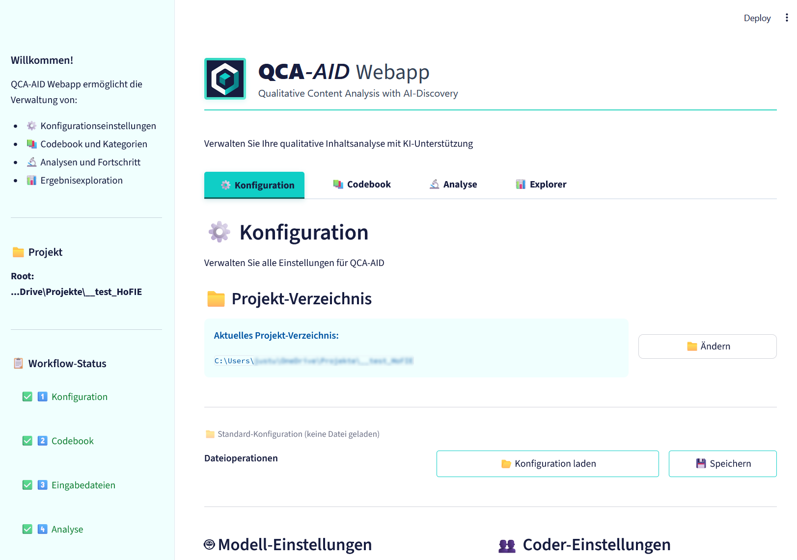
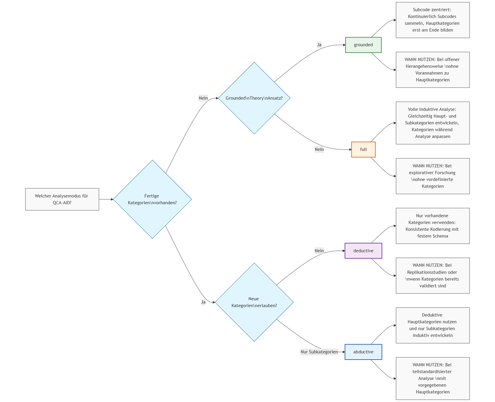

# QCA-AID: Qualitative Content Analysis - with AI-supported Discovery

Dieses Python-Tool implementiert Mayrings Methode der deduktiven Qualitativen Inhaltsanalyse mit induktiver Erweiterung mit KI-Unterstützung. Es kombiniert traditionelle qualitative Forschungsmethoden mit modernen KI-Fähigkeiten, um Forschende bei der Analyse von Dokumenten- und Interviewdaten zu unterstützen. 

**Das Ziel dieses Tools ist nicht, die menschliche Arbeit der Inhaltsanalyse zu ersetzen, sondern neue Möglichkeiten zu eröffnen, mehr Zeit für die Analyse und Reflexion bereits vorstrukturierter Textdaten zu gewinnen.**

## Anwendungsmöglichkeiten von QCA-AID

- Es ermöglicht mehr Dokumente in einer Untersuchung zu berücksichtigen als in herkömmlichen Verfahren, bei denen Personalkapazitäten stark begrenzt sind.    
- Es ermöglicht die Umsetzung von Intercoder-Vergleichen mittels zugeschalteten KI-Coder, wo sonst nur ein menschlicher Coder pro Dokument arbeiten würde, und kann damit zur Qualitätsverbesserung beitragen
- QCA-AID kann auch ganz ohne KI-Coder genutzt werden, als Alternative zu kostenpflichtigen Programmen.
- Es ermöglicht zusätzliche explorative Dokumentenanalysen, die sonst aus pragmatischen Gründen mit einfacheren Verfahren umgesetzt würden

**Zu beachten**

- Gefahr der Überkonfidenz in eine automatisiert ermittelte Struktur der Daten 
- Bei geringer Anzahl von Dokumenten überwiegen weiterhin die Vorteile menschlicher Kodierung (Close-reading, Kontextverständnis, Erfahrung)

**ACHTUNG!**

Bitte beachten Sie, dass sich dieses Tool noch in der Entwicklung befindet und möglicherweise noch nicht alle Funktionen optimal arbeiten. Es wird aktuell eine Nutzung zu Testzwecken empfohlen, wenn die Ergebnisse einer manuellen Prüfung des Outputs reliabel und valide sind, kann eine weiterführende Nutzung in Betracht gezogen werden. Am besten kodieren Sie dafür einen Teil der Dokumente (z.B. 10%) manuell und nutzen sie die integrierte Intercoderanalyse.

Prüfen Sie regelmäßig, ob eine neue Version hier bereitgestellt ist und verfolgen sie die Änderungen.
Beachten Sie auch, dass KI-Ergebnisse nicht perfekt sind und die Ergebnisse von der Qualität der Eingabedaten (Forschungsfrage, Codesystem, Text-Material) abhängen.
Sie verwenden das Tool auf eigene Verantwortung, ohne jegliche Gewährleistung.  

**TIPP: Achten Sie darauf, Ihre Kategorien im Codebook sehr präzise zu formulieren, da die Kodierung sehr sensibel darauf reagiert. Unscharfe Definitionen und Kriterien führen mitunter zu übermäßig freizügiger Kodierung. Textnahe Codes sind meist besser als welche mit hohem Abstraktionsgrad (die benötigen mehr definitorische Erläuterung).**

--> Feedback ist willkommen! <--  
Kontakt: justus.henke@hof.uni-halle.de



## 🔒 Datenschutz-Hinweis

Die KI-gestützte Datenverarbeitung kann auf zwei Arten erfolgen:

### Option 1: Cloud-basierte Modelle (OpenAI, Anthropic, Mistral)
- **Vorteile:** Höchste Qualität, schnelle Verarbeitung, einfache Einrichtung
- **Datenschutz:** Daten werden an externe Anbieter übermittelt
- **Empfehlung:** Prüfen Sie, ob Ihre Dokumente dafür freigegeben sind und entfernen Sie ggf. sensible Informationen
- **Hinweis:** Auch wenn diese Anfragen offiziell nicht für das Training von Modellen genutzt werden, stellt dies eine Verarbeitung durch Dritte dar

### Option 2: Lokale Modelle (LM Studio, Ollama) ⭐ **Empfohlen für sensible Daten**
- **Vorteile:** 
  - ✅ **100% Datenschutz** - Alle Daten bleiben auf Ihrem Computer
  - ✅ **Kostenlos** - Keine API-Gebühren
  - ✅ **Offline-fähig** - Keine Internetverbindung erforderlich
  - ✅ **DSGVO-konform** - Keine Datenübermittlung an Dritte
- **Einrichtung:** 
  - LM Studio: [https://lmstudio.ai/](https://lmstudio.ai/)
  - Ollama: [https://ollama.ai/](https://ollama.ai/)
  - Siehe [LOCAL_MODELS_GUIDE.md](QCA_AID_assets/docs/user_doc/LOCAL_MODELS_GUIDE.md) für detaillierte Anleitung

### Option 3: Custom OpenAI-kompatible Endpoints (z.B. GWDG Academic Cloud) 🎓
- **Vorteile:**
  - ✅ **Institutioneller Zugang** - Nutzung über Universitäts-/Forschungseinrichtungen
  - ✅ **Datenschutz-konform** - Datenverarbeitung in vertrauenswürdigen Rechenzentren
  - ✅ **Kosteneffizient** - Oft über institutionelle Lizenzen verfügbar
- **Unterstützte Services:**
  - GWDG Academic Cloud (Göttingen)
  - Azure OpenAI
  - Andere OpenAI-kompatible APIs
- **Einrichtung:** Siehe [CUSTOM_PROVIDER_GUIDE.md](QCA_AID_assets/docs/user_doc/CUSTOM_PROVIDER_GUIDE.md) für detaillierte Anleitung

**Für hochsensible Daten wird die Nutzung lokaler Modelle ausdrücklich empfohlen!**

## ⚡ Schnellstart

### Installation

**Voraussetzungen:** Python 3.9 bis 3.12 (nicht 3.13!)

**Empfohlen: Automatische Installation (Windows)**
```bash
# Repository klonen
git clone https://github.com/JustusHenke/QCA-AID.git
cd QCA-AID

# Automatische Installation aller Abhängigkeiten
setup.bat
```

**Alternative: Manuelle Installation**
```bash
# Repository klonen
git clone https://github.com/JustusHenke/QCA-AID.git
cd QCA-AID

# Abhängigkeiten installieren
pip install -r requirements.txt

# Sprachmodell installieren
python -m spacy download de_core_news_sm
```

### Webapp starten

```bash
python start_webapp.py
# Öffnet automatisch im Browser: http://127.0.0.1:8501
```

### CLI-Nutzung

```bash
# Konfiguration vorbereiten (siehe Nutzerhandbuch)
# Dokumente in input/ Ordner legen
python QCA-AID.py
```

## 📚 Dokumentation

- **[Vollständiges Nutzerhandbuch](QCA-AID-Nutzerhandbuch.md)**: Umfassende Anleitung mit methodischen Grundlagen
- **[Konfigurationsanleitung](QCA_AID_app/KONFIGURATION_ANLEITUNG.md)**: Detaillierte Einstellungen
- **[Lokale Modelle Guide](QCA_AID_assets/docs/user_doc/LOCAL_MODELS_GUIDE.md)**: LM Studio & Ollama einrichten
- **[Changelog](CHANGELOG.md)**: Vollständige Release-Historie

## 🎯 Hauptfunktionen

### Webapp (empfohlen für Einsteiger)

Die webbasierte Benutzeroberfläche bietet:

- **Grafische Konfigurationsverwaltung**: Alle Einstellungen über intuitive Oberfläche
- **Visueller Codebook-Editor**: Kategorien strukturiert bearbeiten
- **Integrierte Analyse-Steuerung**: Analysen direkt starten und überwachen
- **Echtzeit-Fortschrittsanzeige**: Live-Updates während der Analyse
- **Explorer-Integration**: Ergebnisse direkt visualisieren
- **Localhost-Only**: Alle Daten bleiben auf Ihrem Computer

**Vorteile gegenüber CLI:**
- Intuitiv, keine Vorkenntnisse erforderlich
- Automatische Inline-Validierung
- Visueller Fortschrittsbalken
- Integrierte Dateiübersicht

### Kodierungsfunktionen

- **Deduktive Kategorienanwendung**: Systematische Anwendung vordefinierter Kategorien
- **Induktive Kategorienerweiterung**: Erkennung neuer Kategorien im Material
- **Abduktiver Modus**: Erweiterung nur auf Subkategorien-Ebene
- **Grounded Theory Modus**: Schrittweise Sammlung von Subcodes
- **Multi-Coder-Unterstützung**: Parallele Kodierung durch mehrere KI- und menschliche Kodierer
- **Kontextuelle Kodierung**: Progressive Dokumentenzusammenfassung
- **Batch-Verarbeitung**: Konfigurierbare Anzahl gleichzeitig zu verarbeitender Segmente
- **Manueller Kodierungsmodus**: Intuitive Benutzeroberfläche für menschliche Kodierung

### Qualitätssicherung

- **Intercoder-Reliabilitätsanalyse**: Automatische Berechnung der Übereinstimmung
- **Konsensbildung**: Mehrstufiger Prozess bei divergierenden Kodierungen
- **Manuelles Code-Review**: Systematische Überprüfung von Kodierungsentscheidungen
- **Kategoriesystem-Validierung**: Überprüfung und Optimierung
- **Sättigungsprüfungen**: Automatische Erkennung theoretischer Sättigung
- **Fortschrittssicherung**: Automatische Sicherung des Kodierfortschritts

### Export und Dokumentation

- **Umfassender Analysebericht**: Excel-Export mit Kodierungen und Statistiken
- **Kategorienentwicklungs-Dokumentation**: Nachvollziehbare Historisierung
- **Codebook-Export**: Speicherung des erweiterten Kodierungssystems
- **Attributbasierte Analyse**: Automatische Extraktion von Metadaten
- **Token-Tracking**: Dokumentation der verwendeten API-Tokens

## 🔧 LLM-Provider

QCA-AID unterstützt mehrere LLM-Provider:

| Provider | Modelle | Datenschutz | API-Key |
|----------|---------|-------------|---------|
| **Lokal** ⭐ | LM Studio, Ollama | ✅ **100% Lokal** | Nicht erforderlich |
| **OpenAI** | GPT-4o, GPT-4o-mini, GPT-4-turbo | ⚠️ Cloud | `OPENAI_API_KEY` |
| **Anthropic** | Claude Sonnet 4.5, Claude 3.5 | ⚠️ Cloud | `ANTHROPIC_API_KEY` |
| **Mistral** | Mistral Large, Medium, Small | ⚠️ Cloud | `MISTRAL_API_KEY` |
| **OpenRouter** | Verschiedene Modelle | ⚠️ Cloud | `OPENROUTER_API_KEY` |

### API-Keys einrichten

Erstellen Sie eine `.env` Datei im Projektverzeichnis:

```bash
# OpenAI
OPENAI_API_KEY=sk-proj-...

# Anthropic
ANTHROPIC_API_KEY=sk-ant-...

# Mistral
MISTRAL_API_KEY=...

# OpenRouter
OPENROUTER_API_KEY=sk-or-...
```

**Wichtig:** Fügen Sie `.env` zu Ihrer `.gitignore` hinzu!

### Lokale Modelle einrichten

**LM Studio (empfohlen für Einsteiger):**
1. Download: [https://lmstudio.ai/](https://lmstudio.ai/)
2. Modell herunterladen und Server starten (Port 1234)
3. In Webapp: "Local (LM Studio/Ollama)" wählen und "🔄 Erkennen" klicken

**Ollama (für fortgeschrittene Nutzer):**
1. Download: [https://ollama.ai/](https://ollama.ai/)
2. Modell laden: `ollama pull llama3.1:8b`
3. In Webapp: "Local (LM Studio/Ollama)" wählen

**Vorteile lokaler Modelle:**
- ✅ 100% Datenschutz - Keine Datenübermittlung
- ✅ Kostenlos - Keine API-Gebühren
- ✅ Offline-fähig - Keine Internetverbindung erforderlich
- ✅ DSGVO-konform - Ideal für sensible Forschungsdaten

## 📖 CLI-Nutzung

### Projektverzeichnis wechseln

Die CLI unterstützt Projektverzeichnis-Wechsel über zwei Methoden:

**Methode 1: Umgebungsvariable (temporär)**
```bash
# Windows
set QCA_AID_PROJECT_ROOT=C:\Pfad\zu\meinem\Projekt
python QCA-AID.py

# Linux/Mac
export QCA_AID_PROJECT_ROOT=/pfad/zu/meinem/projekt
python QCA-AID.py
```

**Methode 2: Konfigurationsdatei (persistent)**

Erstellen Sie eine `.qca-aid-project.json` im QCA-AID-Verzeichnis:
```json
{
  "project_root": "C:/Pfad/zu/meinem/Projekt"
}
```

**Priorität:**
1. Umgebungsvariable `QCA_AID_PROJECT_ROOT`
2. `.qca-aid-project.json` Datei
3. QCA-AID-Verzeichnis (Standard)

### Verzeichnisstruktur

```
QCA-AID/
├── input/                    # Eingabedokumente (.txt, .pdf, .docx)
├── output/                   # Analyseergebnisse
├── QCA-AID-Codebook.xlsx    # Konfiguration (Excel)
├── QCA-AID-Codebook.json    # Konfiguration (JSON)
├── .qca-aid-project.json    # Projekt-Einstellungen (optional)
└── QCA-AID.py               # Hauptskript
```

### Eingabedateien

Unterstützte Formate: `.txt`, `.pdf`, `.docx`

**Namenskonvention für Attribute:**
```
attribut1_attribut2_name.txt
Beispiel: university-type_position_2024-01-01.txt
```

Die Attribute werden für spätere Analysen genutzt.

### Konfiguration

**Excel-Format (QCA-AID-Codebook.xlsx):**
- Vertraute Oberfläche, einfache Bearbeitung
- Ideal für Einsteiger

**JSON-Format (QCA-AID-Codebook.json):**
- 10x schneller beim Laden
- Ideal für Versionskontrolle mit Git
- Bessere Automatisierung

**Automatische Synchronisation:** Beide Formate werden automatisch synchronisiert. Änderungen in einer Datei werden in die andere übertragen.

### Codebook-Struktur

**Tabellenblätter (Excel) / Hauptbereiche (JSON):**

1. **FORSCHUNGSFRAGE**: Zentrale Forschungsfrage
2. **KODIERREGELN**: 
   - Allgemeine Kodierregeln
   - Formatregeln
   - Ausschlusskriterien für Relevanzprüfung
3. **DEDUKTIVE_KATEGORIEN**: 
   - Hauptkategorien mit Definition, Regeln, Beispielen
   - Subkategorien
4. **CONFIG**: Technische Einstellungen

**Wichtige CONFIG-Parameter:**

```
MODEL_PROVIDER: OpenAI, Anthropic, Mistral, Local
MODEL_NAME: z.B. gpt-4o-mini
CHUNK_SIZE: 800-1500 (empfohlen: 1000)
CHUNK_OVERLAP: 30-100 (empfohlen: 50)
BATCH_SIZE: 5-8 (empfohlen: 5)
ANALYSIS_MODE: deductive, abductive, full, grounded
CODE_WITH_CONTEXT: true/false
```

### Analyse starten

**Empfohlen: Webapp (Standard)**
```bash
# Windows
start.bat

# Oder manuell
python start_QCA-AID-app.py
```

**Alternative: CLI**
```bash
# Dokumente in input/ Ordner legen
# Codebook konfigurieren
python QCA-AID.py
```

**Hinweis:** Beim ersten Start führen Sie `setup.bat` (Windows) aus, um alle Abhängigkeiten automatisch zu installieren.

Die Ergebnisse werden im `output/` Verzeichnis gespeichert:
- `QCA-AID_Analysis_[DATUM].xlsx`: Hauptergebnisdatei
- `category_revisions.json`: Kategorienentwicklung
- `codebook_inductive.json`: Erweitertes Kategoriensystem

## 🎓 Analysemodi



### Deduktiver Modus (`deductive`)
- Ausschließlich vordefinierte Kategorien
- Für Theorieprüfung und Replikationsstudien

### Abduktiver Modus (`abductive`)
- Erweiterung nur auf Subkategorien-Ebene
- Für theoriegeleitete Analysen mit Offenheit für Nuancen

### Vollständiger Modus (`full`)
- Neue Haupt- und Subkategorien möglich
- Für explorative Analysen

### Grounded Theory Modus (`grounded`)
- Schrittweise Sammlung von Subcodes
- Spätere Hauptkategoriengenerierung
- Für datengetriebene Theorieentwicklung

## 💡 Best Practices

### Kategoriensystem-Design
- Begrenzen Sie Hauptkategorien auf 5-7
- Stellen Sie sicher, dass sie sich gegenseitig ausschließen
- Definieren Sie klare Abgrenzungskriterien
- Entwickeln Sie Subkategorien schrittweise

### Kodierregeln
- Formulieren Sie Regeln präzise und operationalisierbar
- Geben Sie Beispiele für typische und grenzwertige Fälle
- Definieren Sie Ausschlusskriterien klar

### Qualitätssicherung
- Kodieren Sie regelmäßig manuell (z.B. 10% der Segmente)
- Vergleichen Sie mit automatischen Kodierungen
- Nutzen Sie Intercoder-Reliabilitätsanalyse
- Dokumentieren Sie Änderungen am Kategoriensystem

### Performance-Optimierung

**Batch-Größe:**
- Einsteiger: `BATCH_SIZE = 5-6` (optimale Balance)
- Große Datenmengen: `BATCH_SIZE = 10-12` (Geschwindigkeit)
- Hohe Präzision: `BATCH_SIZE = 3-4` (beste Qualität)

**Chunk-Einstellungen:**
- Interviews: `CHUNK_SIZE: 1000, CHUNK_OVERLAP: 50`
- Längere Texte: `CHUNK_SIZE: 1500, CHUNK_OVERLAP: 100`
- Kurze Dokumente: `CHUNK_SIZE: 800, CHUNK_OVERLAP: 30`

## ⚠️ Wichtige Hinweise

**Entwicklungsstatus:**
- QCA-AID befindet sich in aktiver Entwicklung
- Empfohlen für Testzwecke mit manueller Validierung
- Kodieren Sie 10% der Dokumente manuell für Intercoder-Analyse
- Prüfen Sie regelmäßig auf Updates

**Qualitätskontrolle:**
- KI-Ergebnisse sind nicht perfekt
- Ergebnisse hängen von der Qualität der Eingabedaten ab
- Präzise Kategorienformulierung ist entscheidend
- Unscharfe Definitionen führen zu freizügiger Kodierung
- Textnahe Codes sind meist besser als abstrakte

**Nutzung auf eigene Verantwortung, ohne jegliche Gewährleistung.**

## 🐛 Häufige Probleme

### Installation schlägt fehl
- **Windows:** Installieren Sie Microsoft Visual C++ Build Tools
- **Mac/Linux:** Installieren Sie `build-essential`

### spaCy-Import-Fehler
```bash
python -m spacy download de_core_news_sm
```

### API-Schlüssel nicht gefunden
- Überprüfen Sie `.env` Datei im Projektverzeichnis
- Prüfen Sie Gültigkeit und Guthaben des API-Schlüssels

### Dokumentverarbeitung schlägt fehl
- Konvertieren Sie Dokumente zu `.txt`
- Entfernen Sie Sonderzeichen und komplexe Formatierungen
- Entfernen Sie Literaturverzeichnisse

## 📄 Zitiervorschlag

```
Henke, J. (2026). QCA-AID: Qualitative Content Analysis with AI-supported Discovery 
(Version 0.12.4) [Software]. Institut für Hochschulforschung Halle-Wittenberg. 
https://github.com/JustusHenke/QCA-AID
```

**BibTeX:**
```bibtex
@software{Henke_QCA-AID_2025,
  author       = {Henke, Justus},
  title        = {{QCA-AID: Qualitative Content Analysis with AI-supported Discovery}},
  month        = december,
  year         = {2025},
  publisher    = {Institut für Hochschulforschung Halle-Wittenberg},
  version      = {0.12.2},
  url          = {https://github.com/JustusHenke/QCA-AID}
}
```

## 📧 Kontakt & Feedback

Feedback ist willkommen!  
**Kontakt:** justus.henke@hof.uni-halle.de

## 📜 Lizenz

Siehe [LICENSE](LICENSE) Datei für Details.
