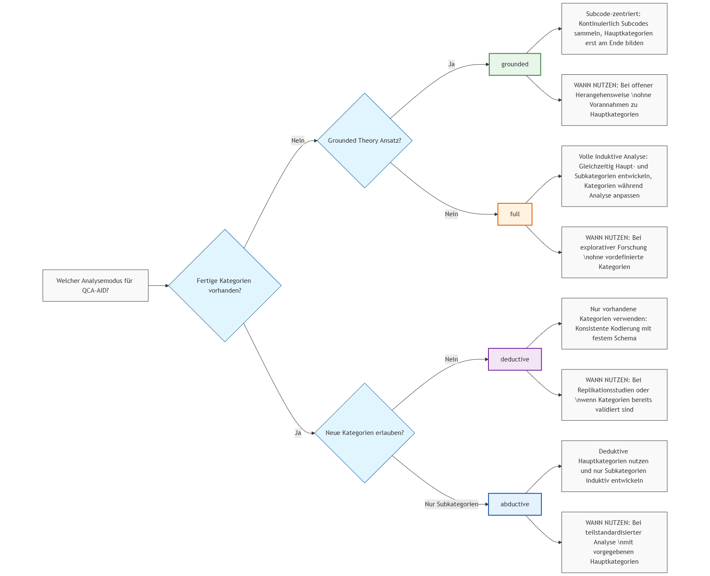

# QCA-AID: Qualitative Content Analysis - AI Discovery

Dieses Python-Skript implementiert Mayrings Methode der deduktiven Qualitativen Inhaltsanalyse mit induktiver Erweiterung mit KI-Unterstützung durch die OpenAI API. Es kombiniert traditionelle qualitative Forschungsmethoden mit modernen KI-Fähigkeiten, um Forschende bei der Analyse von Dokumenten- und Interviewdaten zu unterstützen. Das Ziel dieses Tools ist nicht, die menschliche Arbeit der Inhaltsanalyse zu ersetzen, sondern neue Möglichkeiten zu eröffnen, mehr Zeit für die Analyse und Reflexion bereits vorstrukturierter Textdaten zu gewinnen. 

## Inhaltsverzeichnis

### Grundlagen
- [Anwendungsmöglichkeiten](#anwendungsmöglichkeiten)
- [Zu beachten](#zu-beachten)
- [Hinweis zum Datenschutz](#hinweis-zum-datenschutz)

### Funktionen
- [Merkmale von QCA-AID](#merkmale-von-qca-aid)
  - [Textverarbeitung und Vorbereitung](#textverarbeitung-und-vorbereitung)
  - [Kodierungsfunktionen](#kodierungsfunktionen)
  - [Qualitätssicherung](#qualitätssicherung)
  - [Export und Dokumentation](#export-und-dokumentation)
  - [Konfiguration und Anpassbarkeit](#konfiguration-und-anpassbarkeit)

### Versionen und Updates
- [Neu in 0.9.15](#neu-in-0915-2025-06-02)
- [Neu in 0.9.14](#neu-in-0914-2025-05-28)
- [Neu in 0.9.13](#neu-in-0913-2025-05-15)
- [Neu in 0.9.12](#neu-in-0912--2025-05-10)
- [Neu in 0.9.11](#neu-in-0911--2025-04-12)
- [Neu in 0.9.10](#neu-in-0910)
- [Neu in 0.9.9](#neu-in-099)

### Installation und Einrichtung
- [Empfehlungen für die Installation](#empfehlungen-für-die-installation)
- [Installation](#installation)
- [Speichern des API-Schlüssels](#speichern-des-api-schlüssels)

### Konfiguration und Nutzung
- [Unterstützte Eingabedateien](#unterstützte-eingabedateien)
- [QCA-AID: Konfiguration und Nutzung](#qca-aid-konfiguration-und-nutzung)
  - [Codebook.xlsx](#codebookxlsx)
  - [Verzeichnisstruktur](#verzeichnisstruktur)
  - [Starten der Analyse](#starten-der-analyse)

### Praktische Anwendung
- [Empfohlene Workflows](#empfohlene-workflows)
  - [Erste Schritte mit QCA-AID](#1-erste-schritte-mit-qca-aid)
  - [Fortgeschrittene Analysestrategien](#2-fortgeschrittene-analysestrategien)
- [Best Practices](#best-practices)
- [Konfigurationsempfehlungen](#konfigurationsempfehlungen)
- [Tipps für die effiziente Nutzung](#tipps-für-die-effiziente-nutzung)
- [Beispiel für eine typische Analyse](#beispiel-für-eine-typische-analyse)

### Fehlerbehebung
- [Häufige Probleme und Lösungen](#häufige-probleme-und-lösungen)

### Referenzen
- [Zitiervorschlag](#zitiervorschlag)

## Anwendungsmöglichkeiten

- Es ermöglicht mehr Dokumente in einer Untersuchung zu berücksichtigen als in herkömmlichen Verfahren, bei denen Personalkapazitäten stark begrenzt sind.    
- Es ermöglicht die Umsetzung von Intercoder-Vergleichen mittels zugeschalteten KI-Coder, wo sonst nur ein menschlicher Coder pro Dokument arbeiten würde, und kann damit zur Qualitätsverbesserung beitragen
- QCA-AID kann auch ganz ohne KI-Coder genutzt werden, als Alternative zu kostenpflichtigen Programmen.
- Es ermöglicht zusätzliche explorative Dokumentenanalysen, die sonst aus pragmatischen Gründen mit einfacheren Verfahren umgesetzt würden

## Zu beachten

- Gefahr der Überkonfidenz in eine automatisiert ermittelte Struktur der Daten 
- Bei geringer Anzahl von Dokumenten überwiegen weiterhin die Vorteile menschlicher Kodierung (Close-reading, Kontextverständnis, Erfahrung)

__ACHTUNG!__
Bitte beachten Sie, dass sich dieses Skript noch in der Entwicklung befindet und möglicherweise noch nicht alle Funktionen optimal arbeiten. Es wird aktuell eine Nutzung zu Testzwecken empfohlen, wenn die Ergebnisse einer manuellen Prüfung des Outputs reliabel und valide sind, kann eine weiterführende Nutzung in Betracht gezogen werden. Am besten kodieren Sie dafür einen Teil der Dokumente (z.B. 10%) manuell und nutzen sie die integrierte Intercoderanalyse.

Prüfen Sie regelmäßig, ob eine neue Version hier bereitgestellt ist und verfolgen sie die Änderungen.
Beachten Sie auch, dass KI-Ergebnisse nicht perfekt sind und die Ergebnisse von der Qualität der Eingabedaten (Forschungsfrage, Codesystem, Text-Material) abhängen.
Sie verwenden das Skript auf eigene Verantwortung, ohne jegliche Gewährleistung.  

--> Feedback ist willkommen! <--
Kontakt: justus.henke@hof.uni-halle.de

## Hinweis zum Datenschutz

Die KI-gestützte Datenverarbeitung nutzt die Schnittstelle von OpenAI bzw. Mistral. Auch wenn diese Anfragen offiziell nicht für das Training von Modellen genutzt werden, stellt diese eine Verarbeitung durch Dritte dar. Prüfen Sie, ob Ihre Dokumente dafür freigegeben sind und entfernen Sie ggf. sensible Informationen. Eine Nutzung mit hochsensiblen Daten wird ausdrücklich nicht empfohlen. 

Prinzipiell ist die Verarbeitung der Daten per LLM auch auf einem lokalen Rechner möglich. Dafür kann OLLAMA oder LMSTUDIO genutzt werden und das Setup im Client muss etwas angepasst werden. Mehr dazu hier: https://ollama.com/blog/openai-compatibility oder https://lmstudio.ai/docs/api/endpoints/openai

## Merkmale von QCA-AID

### Textverarbeitung und Vorbereitung
- **Automatisierte Textvorverarbeitung**: Konvertierung verschiedener Dokumentformate (.txt, .pdf, .docx)
- **Intelligentes Chunking**: Aufteilung von Texten in analysierbare Segmente mit konfigurierbarer Überlappung
- **Relevanzprüfung**: Automatische Bewertung der Textsegmente vor der Kodierung mit konfigurierbaren Ausschlusskriterien

### Kodierungsfunktionen
- **Deduktive Kategorienanwendung**: Systematische Anwendung vordefinierter Kategorien
- **Induktive Kategorienerweiterung**: Erkennung neuer Kategorien und Subkategorien im Material
- **Abduktiver Modus**: Erweiterung nur auf Subkategorien-Ebene ohne neue Hauptkategorien
- **Grounded Theory Modus**: Schrittweise Sammlung von Subcodes mit späterer Hauptkategoriengenerierung
- **Multi-Coder-Unterstützung**: Parallele Kodierung durch mehrere KI- und optionale menschliche Kodierer
- **Kontextuelle Kodierung**: Progressive Dokumentenzusammenfassung für kontextsensitive Analyse
- **Batch-Verarbeitung**: Konfigurierbare Anzahl gleichzeitig zu verarbeitender Textsegmente
- **Manueller Kodierungsmodus**: Intuitive Benutzeroberfläche für menschliche Kodierung mit Fortschrittssicherung

### Qualitätssicherung
- **Intercoder-Reliabilitätsanalyse**: Automatische Berechnung der Übereinstimmung zwischen Kodierern
- **Konsensbildung**: Mehrstufiger Prozess zur Konsensfindung bei divergierenden Kodierungen
- **Manuelles Code-Review**: Systematische Überprüfung und Korrektur von Kodierungsentscheidungen
- **Kategoriesystem-Validierung**: Überprüfung und Optimierung des Kategoriensystems
- **Sättigungsprüfungen**: Iterative Analyse mit automatischer Erkennung theoretischer Sättigung
- **Fortschrittssicherung**: Automatische Sicherung des Kodierfortschritts für kontinuierliche Arbeit

### Export und Dokumentation
- **Umfassender Analysebericht**: Excel-Export mit Kodierungen, Häufigkeitsanalysen und Intercoderstatistiken
- **Kategorienentwicklungs-Dokumentation**: Nachvollziehbare Historisierung aller Änderungen am Kategoriensystem
- **Codebook-Export**: Speicherung des erweiterten Kodierungssystems für zukünftige Analysen
- **Attributbasierte Analyse**: Automatische Extraktion von Metadaten aus Dateinamen für vergleichende Auswertungen
- **Token-Tracking**: Schätzung und Dokumentation der verwendeten API-Tokens

### Konfiguration und Anpassbarkeit
- **Flexible Modellwahl**: Unterstützung verschiedener KI-Anbieter (OpenAI und Mistral)
- **Konfigurierbare Parameter**: Anpassung von Chunk-Größe, Überlappung, Batch-Größe und weiteren Einstellungen
- **Temperaturstufen**: Steuerung der "Kreativität" bei der induktiven Kategorienentwicklung
- **Anpassbarer Analysemodus**: Wahl zwischen vollständiger, abduktiver, deduktiver oder grounded Theory Analyse
- **Excel-basierte Konfiguration**: Einfache Anpassung aller Einstellungen über Excel-Dateien
- **Erweiterte Visualisierungsoptionen**: Konfigurierbare Diagramme und Analysen im QCA-AID-Explorer

## Neu in 0.9.15 (2025-06-02)
- COMPLETE RESTRUCTURING OF INDUCTIVE MODE: Vollständige Neustrukturierung des induktiven Modus
  • Vereinfachte und robustere Kategorienentwicklung mit verbesserter Konsistenz
  • Optimierte Sättigungsprüfung und stabilere Kategorienvalidierung
  • Reduzierte Komplexität bei gleichzeitig erhöhter Methodentreue
- IMPROVED ABDUCTIVE MODE: Verbesserungen beim abduktiven Modus
  • Präzisere Subkategorien-Entwicklung zu bestehenden Hauptkategorien
  • Bessere Integration neuer Subkategorien in das bestehende System
- GRACEFUL ANALYSIS INTERRUPTION: Analyse kann mit ESC-Taste abgebrochen werden
  • Zwischenergebnisse werden automatisch gespeichert bei Benutzerabbruch
  • Wiederaufnahme der Analyse ab dem letzten Checkpoint möglich
  • Vollständige Datenintegrität auch bei vorzeitigem Abbruch
- MASSIVE PERFORMANCE BOOST: 4x Beschleunigung durch Parallelisierung
  • Parallele Verarbeitung aller Segmente eines Batches gleichzeitig
  • Optimierte API-Calls durch intelligente Bündelung
  • Dramatisch reduzierte Analysezeiten bei großen Datenmengen
- Enhanced error handling and stability improvements
- Improved progress monitoring and user feedback
- Optimized memory usage for large document sets

## Neu in 0.9.14 (2025-05-28)
- Implementierung der Mehrfachkodierung von Textsegmenten für mehrere Hauptkategorien
- Neue CONFIG-Parameter: MULTIPLE_CODINGS (default: True) und MULTIPLE_CODING_THRESHOLD (default: 0.7)
- Erweiterte Relevanzprüfung erkennt Segmente mit Bezug zu mehreren Hauptkategorien (>=70% Relevanz)
- Fokussierte Kodierung: Segmente werden gezielt für jede relevante Hauptkategorie kodiert
- Export-Erweiterung: Mehrfach kodierte Segmente erscheinen pro Hauptkategorie separat in der Outputtabelle
- Neue Export-Felder: Mehrfachkodierung_Instanz, Kategorie_Fokus, Fokus_verwendet
- Eindeutige Chunk-IDs mit Instanz-Suffix bei Mehrfachkodierung (z.B. "DOC-5-1", "DOC-5-2")
- Effiziente Batch-Verarbeitung und Caching für Mehrfachkodierungs-Prüfungen
- Konfigurierbare Deaktivierung der Mehrfachkodierung für traditionelle Einzelkodierung

## Neu in 0.9.13 (2025-05-15)
- Vollständige Implementierung des 'majority' Review-Modus mit einfacher Mehrheitsentscheidung
- Neue 'manual_priority' Option bevorzugt manuelle vor automatischen Kodierungen
- Korrigierte Review-Logik: REVIEW_MODE wird jetzt korrekt respektiert, unabhängig von Kodierer-Typ
- Konsistente Behandlung der REVIEW_MODE Konfiguration mit einheitlichem Standard 'consensus'
- Verbesserte Tie-Breaking-Mechanismen bei Gleichstand zwischen Kodierungen
- Erweiterte Dokumentation der Review-Modi im consensus_info Export-Feld

## Neu in 0.9.12  (2025-05-10)
- Verbesserter manueller Kodierungsworkflow mit korrekter Handhabung des letzten Segments
- Verbesserte Funktionalität der Schaltflächen "Kodieren & Abschließen" für eine intuitivere Vervollständigung der Kodierung
- Robustes manuelles Code-Review-System zur Behebung von Unstimmigkeiten zwischen den Codierern hinzugefügt
- Die Tkinter-Ressourcenverwaltung wurde verbessert, um Fehler beim Schließen von Fenstern zu vermeiden
- Verbesserte Fehlerbehandlung für den Export von Überprüfungsentscheidungen
- Allgemeine Stabilitätsverbesserungen für die Schnittstelle zur manuellen Kodierung
- Neue Funktion zur automatischen Sicherung des Kodierfortschritts
- Verbesserte Benutzerführung im manuellen Kodierungsmodus
- Optimierte Darstellung der Kodierhistorie

## Neu in 0.9.11  (2025-04-12)
- Neuer 'grounded' Analysemodus hinzugefügt, inspiriert von Grounded Theory und Kuckartz
- Im 'grounded' Modus werden die Subcodes schrittweise gesammelt, ohne sie den Hauptkategorien zuzuordnen
- Die gesammelten Subcodes werden vom deduktiven Kodierer direkt zur Kodierung verwendet
- Nach der Verarbeitung aller Segmente werden aus den Subcodes anhand von Schlüsselwörtern Hauptkategorien generiert
- Die Subcodes werden im endgültigen Export mit den generierten Hauptkategorien abgeglichen
- Die Ausgabe wird im Codebuch und in den Exporten als "grounded" (nicht "induktiv") gekennzeichnet
- Verbesserte Fortschrittsvisualisierung während der Subcode-Erfassung
- Verbesserte Handhabung von Schlüsselwörtern mit direkter Verbindung zu Subcodes

## Neu in 0.9.10
QCA-AID-Explorer.py
- kann mit Excel konfiguriert werden und muss nicht mehr manuell angepasst werden.
- Konfiguration über Excel-Datei "QCA-AID-Explorer-Config.xlsx"
- Heatmap-Visualisierung von Codes entlang von Dokumentattributen
- Mehrere Analysetypen konfigurierbar (Netzwerk, Heatmap, verschiedene Zusammenfassungen)
- Anpassbare Parameter für jede Analyse
QCA-AID.py
- Hinzufügen eines Präfixes zur Chunk-Nummer für eindeutige Segment-IDs
- prägnantere progessive Zusammenfassungen, weniger verlustbehaftet

## Neu in 0.9.9
- Abduktivmodus: induktive Codierung nur für Subcodes ohne Hinzufügen von Hauptcodes
- kann entweder beim starten des Skripts ausgewählt oder im Codebook konfiguriert
- leicht verschärfte Relevanzprüfung für Textsegmente (aus Interviews)
- Kodierkonsens: Segmente ohne Konsens als "kein Kodierkonsens" markieren; wenn kein Konsens besteht, wird die  Kodierung mit höherem Konfidenzwert gewählt, sonst "kein Kodierkonsens"

## Weitere Hinweise zur Version (0.9.8)

- Progressive Dokumentenzusammenfassung als Kodierungskontext (max. 80 Wörter)
- Aktivieren durch Setzen des CONFIG-Wertes `CODE_WITH_CONTEXT` im Codebook auf 'true' (Standard: false)
- Eignet sich insbesondere bei deduktivem Kodieren. Es kann Einfluss auf die Kodierung nehmen, daher testen, ob die Funktion zu besseren Ergebnissen führt. Den Kontext beizufügen, erleichtert es dem Sprachmodell einzuschätzen, ob die Inhalte im größeren Zusammenhang des Textes bedeutsam sind. Damit wird gewissermaßen ein Gedächtnis des bisherigen Textes in die Verarbeitung des Textsegments integriert. 

## Weitere Hinweise zur Version (0.9.7)

- NEU: Mistral Support! Es kann jetzt auch die Mistral API genutzt werden. Umschalten zwischen OpenAI und Mistral mit CONFIG-Parameter 'MODEL_PROVIDER'. Standardmodell für OpenAI ist 'GPT-4o-mini', für Mistral 'mistral-small'.
- NEU: Ausschlusskriterien während der Relevanzprüfung in 'KODIERREGELN' definieren (z.B. Literaturverzeichnis)
- NEU: Hinzufügen von Ausschlusskriterien für die Relevanzprüfung in Codebuch-Kodierregeln
- NEU: Export von Begründungen für nicht relevante Textsegmente
- Verbesserte Relevanzprüfung, Rechtfertigung und Aufforderung zur Kodierung von Segmenten
- NEU: Erstellen von Zusammenfassungen und Diagrammen aus Ihren kodierten Daten mit 'QCA-AID-Explorer.py'.

## Weitere Hinweise 
- Sollte die induktive Kodierung zu großzügig sein und zu viele Subcodes erstellen, kann können Sie den CONFIG-Wert `Temperature` herunterregeln (z.B. auf '0.1'), dann wird konservativer kodiert. 
- Beachten Sie, dass die Forschungsfrage am besten alle Aspekte der Hauptkategorien abdeckt bzw. letztere sich aus der Frage ableiten lassen. Damit ist eine zuverlässigere Kodierung möglich, da die Forschungsfrage zentral ist, um ein Textsegment als relevant vorauszuwählen. Die Forschungsfrage sollte die Aspekte der Hauptkategorien möglichst ausgewogen adressieren und nicht bereits eine Hauptkategorie bevorzugen (es sei denn, das ist beabsichtigt).
- Während der Bearbeitung werden mehrere API-Calls durchgeführt (Relevanzprüfung, Code-Entwicklung, Sättigungsprüfung), die Verarbeitung von Texten ist also relativ langsam: Ca. 400 Textsegmente à 1.000 Zeichen je Stunde, also ca. 200-250 Seiten je Stunde.  
- Momentan wird nur Konsensentscheidung der Kodierer zugelassen, Mehrheitsvoting (bei n>2 Kodierern) oder Manuelles Review bei unterschiedlichen Kodierungen für ein Segment ist noch nicht implementiert. 
- Die Konsensbildung erfolgt in einem mehrstufigen Prozess: Zunächst wird die Hauptkategorie mit der höchsten Übereinstimmung unter den Kodierern bestimmt, wobei bei Gleichstand die Kategorie mit der höchsten durchschnittlichen Konfidenz gewählt wird. Anschließend werden Subkategorien identifiziert, die von mindestens 50 % der Kodierer genutzt wurden, und die finale Konsens-Kodierung basiert auf der qualitativ besten Einzelskodierung mit den ermittelten Konsens-Subkategorien.

## Zitiervorschlag

Henke, J. (2025). QCA-AID: Qualitative Content Analysis with AI Support (Version 0.9.15) [Software]. 
Institut für Hochschulforschung Halle-Wittenberg. https://github.com/JustusHenke/QCA-AID

```BibTex
@software{Henke_QCA-AID_2025,
  author       = {Henke, Justus},
  title        = {{QCA-AID: Qualitative Content Analysis with AI Support}},
  month        = may,
  year         = {2025},
  publisher    = {Institut für Hochschulforschung Halle-Wittenberg},
  version      = {0.9.13},
  url          = {https://github.com/JustusHenke/QCA-AID}
}
```

## Empfehlungen für die Installation

Bevor Sie mit der Installation beginnen, prüfen Sie folgende Voraussetzungen/Empfehlungen:

1. **GitHub-Konto** (optional): Registrieren Sie sich bei [GitHub](https://github.com/), falls noch nicht geschehen. Dies erleichtert das Synchronisieren von Updates. Synchronisation erfolgt dann mit **Git**: Download verschiedener Clients unter: [https://git-scm.com/downloads](https://git-scm.com/downloads)

2. **OpenAI API-Schlüssel** (sofern nicht Mistral genutzt wird): 
   - Erstellen Sie einen Schlüssel unter: [https://platform.openai.com/api-keys](https://platform.openai.com/api-keys)
   - Fügen Sie ein Zahlungsmittel hinzu und laden Sie Ihr Guthaben auf, da die API kostenpflichtig ist.

3. **Python 3.11 oder älter**:
   - **WICHTIG**: Verwenden Sie Python 3.11 oder älter (z.B. 3.10.12), da QCA-AID aktuell nicht mit Python 3.13 kompatibel ist! Dies liegt daran, dass das Modul spaCy derzeit noch nicht mit Python 3.13 kompatibel ist.
   - Download unter: [https://www.python.org/downloads/release/python-3110/](https://www.python.org/downloads/release/python-3110/)

4. **Nur für Windows-Nutzer**: Microsoft Visual C++ Build Tools
   - Download unter: [https://visualstudio.microsoft.com/de/visual-cpp-build-tools/](https://visualstudio.microsoft.com/de/visual-cpp-build-tools/)
   - Wichtig: Aktivieren Sie im Installer das "C++ Build Tools"-Paket inklusive MSVC und Windows SDK.
5. **Alternativen für  Microsoft Visual C++ Build Tools**:
- Wheel-Pakete: Für gängige Plattformen und Python-Versionen bietet spaCy vorkompilierte Binärpakete (Wheels) an. Wenn ein passendes Wheel verfügbar ist, wird dieses automatisch genutzt und die Build Tools werden nicht benötigt.
- conda-Installation: Bei Verwendung von Anaconda/conda kann spaCy über conda-forge installiert werden, was ebenfalls die Notwendigkeit der Build Tools umgeht

## Installation

1. **Repository klonen**:
   ```bash
   git clone https://github.com/JustusHenke/QCA-AID.git
   cd QCA-AID
   ```

2. **Abhängigkeiten installieren**:
   ```bash
   pip install -r requirements.txt
   ```

3. **Sprachmodell für spaCy installieren**:
   ```bash
   python -m spacy download de_core_news_sm
   ```

4. **Bei Nutzung der Mistral API (optional)**:
   ```bash
   pip install mistralai
   ```

## Speichern des API-Schlüssels

Um den API-Schlüssel sicher zu speichern und zu verwenden, folgen Sie diesen Schritten:

1. **Erstellen Sie eine .environ.env Datei**:
   - Die Datei sollte `.environ.env` im Home-Verzeichnis Ihres Benutzers erstellt werden.
   - Unter Windows ist dies typischerweise: `C:\Users\IhrBenutzername\`
   - Unter macOS und Linux: `/home/IhrBenutzername/`

2. **Dateiinhalt**:
   - Öffnen Sie die .environ.env Datei mit einem Texteditor.
   - Fügen Sie folgende Zeilen hinzu, ersetzen Sie dabei `IhrAPISchlüssel` mit Ihren tatsächlichen API-Schlüsseln:
     ```
     OPENAI_API_KEY=IhrAPISchlüssel
     MISTRAL_API_KEY=IhrAPISchlüssel
     ```

3. **Sicherheitshinweis**:
   - Stellen Sie sicher, dass die .environ.env Datei nicht in öffentliche Repositories hochgeladen wird.
   - Fügen Sie `.environ.env` zu Ihrer .gitignore Datei hinzu, wenn Sie Git verwenden.

## Unterstützte Eingabedateien

Das Programm kann bestimmte Dateitypen im Eingabeverzeichnis (DATA_DIR) verarbeiten. Folgende Dateiformate werden derzeit unterstützt:

1. **Textdateien**:
   - .txt (Plain Text)

2. **Dokumentformate**:
   - .pdf (Portable Document Format)
   - .docx (Microsoft Word)

Hinweise zur Verwendung:
- Stellen Sie sicher, dass Ihre Eingabedateien in einem der oben genannten Formate vorliegen.
- Das Programm liest alle unterstützten Dateien im Eingabeverzeichnis automatisch ein.
- Bei der Verwendung von PDF-Dateien wird der Text extrahiert; komplexe Formatierungen oder eingebettete Bilder werden dabei nicht berücksichtigt.

Für optimale Ergebnisse wird die Verwendung von einfachen Textformaten (.txt) empfohlen, insbesondere für längere Textpassagen oder Transkripte. Entfernen Sie Literaturverzeichnisse und andere Textteile, die nicht kodiert werden sollen.

**Wichtig**: 
- Stellen Sie sicher, dass alle Dateien im Eingabeverzeichnis für die Analyse relevant sind, da das Programm versuchen wird, jede unterstützte Datei zu verarbeiten.
- Andere Dateiformate wie .csv, .md, .srt oder .vtt werden derzeit nicht unterstützt. Konvertieren Sie diese gegebenenfalls in eines der unterstützten Formate.

## QCA-AID: Konfiguration und Nutzung



### Codebook.xlsx

Die Excel-Datei `QCA-AID-Codebook.xlsx` ist zentral für die Konfiguration der Analyse und enthält:

#### Tabellenblätter
- **FORSCHUNGSFRAGE**: Tragen Sie Ihre Forschungsfrage in Zelle B1 ein
- **KODIERREGELN**: Allgemeine Kodierregeln (Spalte A), Formatregeln (Spalte B), Ausschlusskriterien für die Relevanzprüfung (Spalte C)
- **DEDUKTIVE_KATEGORIEN**: Hauptkategorien mit Definition, Regeln, Beispielen und Subkategorien
- **CONFIG**: Technische Einstellungen wie Modell, Verzeichnisse und Chunk-Größen

#### Struktur der DEDUKTIVE_KATEGORIEN

     | Key       | Sub-Key     | Sub-Sub-Key | Value                        |
     |-----------|-------------|-------------|------------------------------|
     | Akteure   | definition  |             | Erfasst alle handelnden...   |
     | Akteure   | rules       |             | Codiere Aussagen zu: Indi... |
     | Akteure   | examples    | [0]         | Die Arbeitsgruppe trifft...  |
     | Akteure   | subcategories | Individuelle_Akteure | Einzelpersonen und deren... |

#### Struktur der CONFIG
Hier können Sie verschiedene Konfigurationsparameter einstellen:
- **MODEL_PROVIDER**: Name des LLM-Anbieters ('OpenAI' oder 'Mistral')
- **MODEL_NAME**: Name des zu verwendenden Sprachmodells
- **DATA_DIR**: Verzeichnis für Eingabedaten
- **OUTPUT_DIR**: Verzeichnis für Ausgabedaten
- **CHUNK_SIZE**: Größe der Textabschnitte für die Analyse
- **CHUNK_OVERLAP**: Überlappung zwischen Textabschnitten
- **BATCH_SIZE**: Anzahl der parallel zu verarbeitenden Textabschnitte (Standard: 5)
- **ATTRIBUTE_LABELS**: Bezeichnungen für Attribute, die aus dem Dateinamen extrahiert werden (z.B. "Part1_Part2_Restname.txt")
- **CODER_SETTINGS**: Einstellungen für automatische Kodierer
- **ANALYSIS_MODE**: Analysemodus ('full', 'abductive', 'deductive', 'grounded')
- **CODE_WITH_CONTEXT**: Aktiviert kontextuelle Kodierung (true/false)
- **AUTO_SAVE_INTERVAL**: Intervall für automatische Sicherung des Kodierfortschritts (in Minuten)
- **MANUAL_CODING_ENABLED**: Aktiviert den manuellen Kodierungsmodus (true/false)
- **REVIEW_MODE**: Modus für die Überprüfung von Kodierungen ('consensus', 'majority', 'manual_priority')


#### CODE_WITH_CONTEXT

Wenn CONFIG-Parameter `CODE_WITH_CONTEXT` aktiviert ist (True), nutzt QCA-AID einen progressiven Dokumentkontext für die Kodierung.
Dabei wird für jedes Dokument ein fortlaufend aktualisiertes Summary erstellt, das bei
der Kodierung der nachfolgenden Chunks als Kontext verwendet wird.

Vorteile:
- Bessere Kontextsicherheit durch Berücksichtigung vorheriger Dokumentinhalte
- Verbesserte Kodierqualität bei kontextabhängigen Kategorien (z.B. "dominante Akteure")
- Mehr Konsistenz in der Kodierung eines Dokuments

Nachteile:
- Dokumente müssen sequentiell verarbeitet werden
- Geringer erhöhter Tokenverbrauch
- Mögliche Fehlerfortpflanzung bei falsch interpretierten frühen Abschnitten

Empfehlung:
- Für Analysen mit hierarchischen oder relationalen Kategorien aktivieren
- Für einfache thematische Kategorisierungen kann ohne Kontext gearbeitet werden


### Verzeichnisstruktur

#### Eingabeverzeichnis (input)
- Standardpfad: `input/` im Skriptverzeichnis
- Unterstützte Formate:
  - .txt (Textdateien)
  - .pdf (PDF-Dokumente)
  - .docx (Word-Dokumente)
- Namenskonvention: `attribut1_attribut2_weiteres.extension`
  - Beispiel: `university-type_position_2024-01-01.txt`
  - Die Attribute werden für spätere Analysen genutzt

#### Ausgabeverzeichnis (output)
- Standardpfad: `output/` im Skriptverzeichnis
- Erzeugte Dateien:
  - `QCA-AID_Analysis_[DATUM].xlsx`: Hauptergebnisdatei mit Kodierungen und Analysen
  - `category_revisions.json`: Protokoll der Kategorienentwicklung
  - `codebook_inductive.json`: Erweitertes Kategoriensystem nach induktiver Phase

### Starten der Analyse

1. Stellen Sie sicher, dass Ihre Eingabedokumente im `input/`-Verzeichnis liegen
2. Führen Sie das Skript aus:
   ```bash
   python QCA-AID.py
   ```
3. Folgen Sie den Anweisungen auf dem Bildschirm
4. Die Ergebnisse werden im `output/`-Verzeichnis gespeichert

### Wichtige Hinweise
- Entfernen Sie am besten Literaturverzeichnisse und nicht zu kodierende Textteile aus den Eingabedokumenten
- Prüfen Sie bei PDF-Dokumenten die korrekte Textextraktion
- Sichern Sie regelmäßig die QCA-AID-Codebook.xlsx
- Die Verzeichnispfade können in der CONFIG angepasst werden

## Batch-Größe und Performance-Optimierung

### Was ist die Batch-Größe?

Die **Batch-Größe** bestimmt, wie viele Textsegmente gleichzeitig in einem API-Call verarbeitet werden. Bei einer `BATCH_SIZE` von 6 werden 6 Textsegmente in einem einzigen Prompt zusammengefasst und gemeinsam analysiert.

### Funktionsweise

```python
# Konfiguration in der config.json
{
  "BATCH_SIZE": 8,  // 8 Segmente pro API-Call
  "CHUNK_SIZE": 1200
}
```

**Beispiel-Prompt bei BATCH_SIZE = 3:**
```
SEGMENT 1:
[Ihr erster Textabschnitt...]

=== SEGMENT BREAK ===

SEGMENT 2: 
[Ihr zweiter Textabschnitt...]

=== SEGMENT BREAK ===

SEGMENT 3:
[Ihr dritter Textabschnitt...]

Analysiere alle 3 Segmente und kodiere sie entsprechend.
```

### Auswirkungen verschiedener Batch-Größen

| Batch-Größe | Geschwindigkeit | Kosten | Qualität | Empfohlen für |
|-------------|----------------|--------|----------|---------------|
| **1-3** | 🐌 Langsam | 💰💰💰 Hoch | ⭐⭐⭐ Sehr gut | Präzise Analysen, komplexe Texte |
| **4-8** | 🚀 Mittel | 💰💰 Moderat | ⭐⭐ Gut | **Standard-Empfehlung** |
| **9-15** | ⚡ Schnell | 💰 Niedrig | ⭐ Akzeptabel | Große Datenmengen, explorative Analysen |

### Performance-Boost durch Parallelisierung

QCA-AID v0.9.15+ nutzt **parallele Batch-Verarbeitung** für bis zu **4x schnellere** Analysen:

```
Ohne Parallelisierung:  Batch 1 → Batch 2 → Batch 3 → Batch 4
Mit Parallelisierung:   Batch 1 ↘
                        Batch 2 → Alle gleichzeitig → Fertig!
                        Batch 3 ↗
                        Batch 4 ↙
```

### Empfehlungen

- **Einsteiger:** `BATCH_SIZE = 5-6` für optimale Balance
- **Große Datenmengen:** `BATCH_SIZE = 10-12` für Geschwindigkeit  
- **Hohe Präzision:** `BATCH_SIZE = 3-4` für beste Qualität
- **Token-Budget begrenzt:** Größere Batches sparen bis zu 40% der API-Kosten

### Anpassung der Batch-Größe

Editieren Sie den Wert für das Feld `BATCH_SIZE` im Codebook.xlsx im Blatt "CONFIG"

> **💡 Tipp:** Starten Sie mit der Standard-Einstellung (`BATCH_SIZE = 8`) und passen Sie bei Bedarf an. Das Skript zeigt Ihnen die Verarbeitungsgeschwindigkeit in Echtzeit an.

## Häufige Probleme und Lösungen

### 1. Fehler bei der Installation der Abhängigkeiten
Wenn `pip install -r requirements.txt` fehlschlägt:
- Bei Windows-Nutzern: Stellen Sie sicher, dass die C++ Build Tools korrekt installiert sind
- Bei Mac/Linux: Installieren Sie die erforderlichen Entwicklungsbibliotheken (`build-essential` für Ubuntu/Debian)

### 2. Fehler beim Importieren von spaCy
Wenn das Programm mit einem Fehler beim Importieren von spaCy abbricht:
```
Bitte installieren Sie das deutsche Sprachmodell:
python -m spacy download de_core_news_sm
```

### 3. API-Schlüssel nicht gefunden
- Überprüfen Sie, ob die .environ.env Datei im richtigen Verzeichnis liegt
- Überprüfen Sie, ob der API-Schlüssel gültig ist und noch Guthaben vorhanden ist

### 4. Fehler bei der Verarbeitung bestimmter Dokumenttypen
- Versuchen Sie, das Dokument in das .txt-Format zu konvertieren
- Prüfen Sie, ob das Dokument Sonderzeichen oder komplexe Formatierungen enthält

### 5. Probleme mit dem manuellen Kodierungsmodus
- Wenn die Kodierungsoberfläche nicht startet, prüfen Sie die Tkinter-Installation
- Bei Problemen mit der Fortschrittssicherung: Überprüfen Sie die AUTO_SAVE_INTERVAL-Einstellung
- Bei Darstellungsproblemen: Stellen Sie sicher, dass Ihre Bildschirmauflösung ausreichend ist

### 6. Probleme mit dem QCA-AID-Explorer
- Bei Fehlern bei der Excel-Konfiguration: Überprüfen Sie das Format der QCA-AID-Explorer-Config.xlsx
- Bei Visualisierungsproblemen: Stellen Sie sicher, dass alle erforderlichen Python-Pakete installiert sind
- Bei Export-Fehlern: Überprüfen Sie die Schreibrechte im Ausgabeverzeichnis

## Praktische Anwendungshinweise

### Empfohlene Workflows

#### 1. Erste Schritte mit QCA-AID
1. **Vorbereitung der Daten**:
   - Bereiten Sie Ihre Texte vor (Entfernen von Literaturverzeichnissen, Formatierung)
   - Benennen Sie die Dateien nach dem Schema: `attribut1_attribut2_name.txt`
   - Speichern Sie die Dateien im `input/`-Verzeichnis

2. **Codebook einrichten**:
   - Definieren Sie Ihre Forschungsfrage präzise
   - Erstellen Sie ein initiales Kategoriensystem
   - Legen Sie klare Kodierregeln fest
   - Wählen Sie den passenden Analysemodus

3. **Erste Testkodierung**:
   - Starten Sie mit einer kleinen Stichprobe (2-3 Dokumente)
   - Prüfen Sie die Qualität der automatischen Kodierung
   - Passen Sie ggf. das Kategoriensystem an

#### 2. Fortgeschrittene Analysestrategien

##### Deduktive Analyse mit induktiver Erweiterung
1. Beginnen Sie mit einem gut definierten Kategoriensystem
2. Aktivieren Sie den 'full' Analysemodus
3. Nutzen Sie die induktiven Erweiterungen zur Systematisierung
4. Überprüfen Sie neue Kategorien regelmäßig

##### Grounded Theory Ansatz
1. Wählen Sie den 'grounded' Analysemodus
2. Lassen Sie das System Subcodes sammeln
3. Überprüfen Sie die generierten Hauptkategorien
4. Verfeinern Sie das System iterativ

##### Intercoder-Vergleich
1. Aktivieren Sie mehrere KI-Coder in den CODER_SETTINGS
2. Wählen Sie den passenden REVIEW_MODE:
   - 'consensus': Nur übereinstimmende Kodierungen
   - 'majority': Mehrheitsentscheidung bei mehreren Kodierern
   - 'manual_priority': Manuelle Kodierungen haben Vorrang
3. Nutzen Sie die Intercoder-Statistiken zur Qualitätssicherung

### Best Practices

#### Kategoriensystem-Design
- **Hauptkategorien**: 
  - Begrenzen Sie die Anzahl auf 5-7 Kategorien
  - Stellen Sie sicher, dass sie sich gegenseitig ausschließen
  - Definieren Sie klare Abgrenzungskriterien

- **Subkategorien**:
  - Entwickeln Sie sie schrittweise
  - Dokumentieren Sie die Entwicklung im Codebook
  - Nutzen Sie Beispiele zur Verdeutlichung

#### Kodierregeln
- Formulieren Sie Regeln präzise und operationalisierbar
- Geben Sie Beispiele für typische und grenzwertige Fälle
- Definieren Sie Ausschlusskriterien klar

#### Qualitätssicherung
1. **Regelmäßige Überprüfungen**:
   - Kodieren Sie regelmäßig manuell (z.B. 10% der Segmente)
   - Vergleichen Sie mit automatischen Kodierungen
   - Passen Sie das System bei Abweichungen an

2. **Dokumentation**:
   - Führen Sie ein Kodierprotokoll
   - Dokumentieren Sie Änderungen am Kategoriensystem
   - Notieren Sie besondere Entscheidungen

### Konfigurationsempfehlungen

#### Für verschiedene Dokumenttypen
- **Interviews**:
  ```
  CHUNK_SIZE: 1000
  CHUNK_OVERLAP: 200
  CODE_WITH_CONTEXT: true
  ```

- **Längere Texte**:
  ```
  CHUNK_SIZE: 1500
  CHUNK_OVERLAP: 300
  CODE_WITH_CONTEXT: true
  ```

- **Kurze Dokumente**:
  ```
  CHUNK_SIZE: 800
  CHUNK_OVERLAP: 100
  CODE_WITH_CONTEXT: false
  ```

#### Für verschiedene Analysemodi
- **Deduktiv**:
  ```
  ANALYSIS_MODE: deductive
  TEMPERATURE: 0.1
  REVIEW_MODE: consensus
  ```

- **Induktiv**:
  ```
  ANALYSIS_MODE: full
  TEMPERATURE: 0.3
  REVIEW_MODE: majority
  ```

- **Grounded Theory**:
  ```
  ANALYSIS_MODE: grounded
  TEMPERATURE: 0.4
  REVIEW_MODE: manual_priority
  ```

### Tipps für die effiziente Nutzung

1. **Dateiorganisation**:
   - Nutzen Sie aussagekräftige Dateinamen
   - Strukturieren Sie Attribute systematisch
   - Halten Sie Backup-Kopien des Codebooks

2. **Arbeitsablauf**:
   - Sichern Sie regelmäßig Zwischenergebnisse
   - Nutzen Sie die automatische Sicherung
   - Dokumentieren Sie Änderungen am System

3. **Ressourcenmanagement**:
   - Passen Sie BATCH_SIZE an Ihre Hardware an
   - Nutzen Sie CODE_WITH_CONTEXT nur bei Bedarf
   - Überwachen Sie den Token-Verbrauch

4. **Qualitätssicherung**:
   - Führen Sie regelmäßige Plausibilitätsprüfungen durch
   - Nutzen Sie die Intercoder-Statistiken
   - Dokumentieren Sie Kodierentscheidungen

### Beispiel für eine typische Analyse

1. **Vorbereitung**:
   ```
   # Codebook.xlsx einrichten
   FORSCHUNGSFRAGE: "Wie werden digitale Technologien in der Hochschullehre eingesetzt?"
   
   # Hauptkategorien definieren
   - Technologieeinsatz
   - Didaktische Integration
   - Herausforderungen
   - Unterstützungsstrukturen
   ```

2. **Konfiguration**:
   ```
   # CONFIG-Einstellungen
   ANALYSIS_MODE: full
   CHUNK_SIZE: 1000
   CHUNK_OVERLAP: 200
   CODE_WITH_CONTEXT: true
   REVIEW_MODE: consensus
   ```

3. **Durchführung**:
   - Starten Sie mit einer Testkodierung
   - Überprüfen Sie die ersten Ergebnisse
   - Passen Sie das System an
   - Führen Sie die vollständige Analyse durch

4. **Auswertung**:
   - Nutzen Sie den QCA-AID-Explorer
   - Erstellen Sie Visualisierungen
   - Exportieren Sie die Ergebnisse
   - Dokumentieren Sie die Analyse